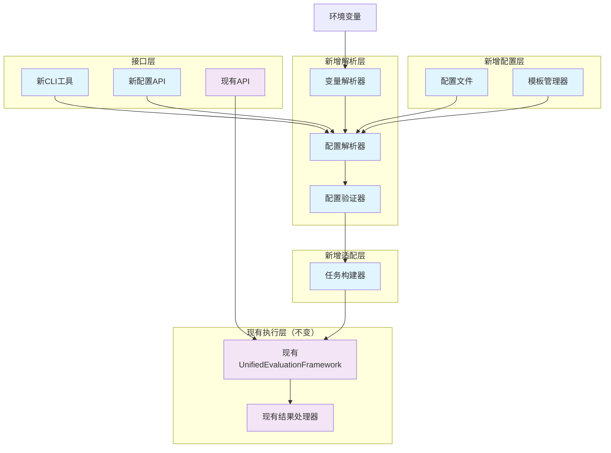

# Design Document

## Overview

配置驱动的评估任务管理系统将为evaluation_engine**添加**配置文件解析和管理功能，允许用户通过声明式配置文件定义评估任务的所有参数。这是一个**扩展功能**，不会修改现有的API接口和核心功能，而是提供一个新的配置驱动的入口点。

**设计原则：**
- **非侵入性**：不修改现有的UnifiedEvaluationFramework和ExtendedTaskRegistry
- **兼容性**：现有的API调用方式完全保持不变
- **扩展性**：新增配置解析层，作为现有框架的上层封装
- **可选性**：用户可以选择使用配置文件或继续使用原有的API方式

系统将支持YAML和JSON格式的配置文件，提供变量替换、模板继承、配置验证等高级功能，并通过命令行工具和API两种方式提供服务。

## Architecture

### 核心组件架构



### 配置文件结构设计

配置文件将采用分层结构，支持以下主要部分：

1. **全局配置** - 默认参数和环境设置
2. **变量定义** - 可重用的变量和模板
3. **任务定义** - 具体的评估任务配置
4. **输出配置** - 结果保存和格式设置

## Components and Interfaces

### 1. 配置解析器 (ConfigParser)

**职责：** 解析YAML/JSON配置文件，处理变量替换和模板继承

**接口：**
```python
class ConfigParser:
    def parse_config(self, config_path: str) -> EvaluationConfig
    def validate_syntax(self, config_path: str) -> ValidationResult
    def resolve_variables(self, config: dict) -> dict
    def merge_templates(self, config: dict) -> dict
    def resolve_model_references(self, config: EvaluationConfig) -> EvaluationConfig
```

**核心功能：**
- 支持YAML和JSON格式自动检测
- 变量替换：`${variable_name}` 语法
- 环境变量引用：`${env:ENV_VAR_NAME}`
- 模板继承：`extends` 关键字
- 配置文件包含：`include` 指令
- 模型引用解析：将task中的model_ref解析为完整的模型配置
- 模型特定的prompt模板处理

### 2. 配置验证器 (ConfigValidator)

**职责：** 验证配置文件的完整性和正确性

**接口：**
```python
class ConfigValidator:
    def validate_config(self, config: EvaluationConfig) -> ValidationResult
    def check_model_availability(self, model_configs: Dict[str, ModelConfig]) -> bool
    def check_lm_eval_tasks(self, task_names: List[str]) -> bool
    def check_model_references(self, tasks: List[TaskConfig], models: Dict[str, ModelConfig]) -> bool
    def validate_prompt_templates(self, model_configs: Dict[str, ModelConfig]) -> bool
```

**验证规则：**
- 必需字段检查
- 数据类型验证
- 模型引用完整性检查（task中的model_ref必须在models中定义）
- lm-eval任务名称有效性验证
- 模型可用性验证
- prompt模板语法验证

### 3. 任务构建器 (TaskBuilder)

**职责：** 根据配置构建可执行的评估任务，并转换为现有框架可接受的格式

**接口：**
```python
class TaskBuilder:
    def __init__(self, framework: UnifiedEvaluationFramework):
        self.framework = framework
    
    def build_tasks(self, config: EvaluationConfig) -> List[EvaluationTask]
    def resolve_dependencies(self, tasks: List[TaskConfig]) -> List[TaskConfig]
    def create_execution_plan(self, tasks: List[EvaluationTask]) -> ExecutionPlan
    def convert_to_framework_format(self, task_config: TaskConfig) -> Dict[str, Any]
```

**核心功能：**
- 将配置文件中的任务定义转换为UnifiedEvaluationFramework可接受的参数格式
- 处理模型引用，将model_ref解析为具体的模型配置
- 管理任务依赖关系和执行顺序
- 不修改现有框架的任何接口，只是作为适配层

### 4. 模型模板管理器 (ModelTemplateManager)

**职责：** 管理不同模型的prompt模板和system prompt

**接口：**
```python
class ModelTemplateManager:
    def get_model_template(self, model_type: str, model_name: str) -> Optional[ModelTemplate]
    def apply_prompt_template(self, template: str, context: Dict[str, Any]) -> str
    def validate_template_syntax(self, template: str) -> bool
    def load_builtin_templates(self) -> Dict[str, ModelTemplate]
```

**内置模板支持：**
- OpenAI模型系列的标准模板
- Anthropic Claude系列的对话模板
- Hugging Face模型的特定格式模板
- 自定义模型模板注册机制

### 5. 命令行接口 (CLI)

**职责：** 提供命令行工具支持

**命令结构：**
```bash
eval-engine config run <config_file> [options]
eval-engine config validate <config_file>
eval-engine config template <template_name>
eval-engine config list-tasks  # 列出可用的lm-eval任务
eval-engine config list-models  # 列出支持的模型类型
```

**选项支持：**
- `--override key=value` - 覆盖配置参数
- `--output-dir` - 指定输出目录
- `--verbose` - 详细日志输出
- `--dry-run` - 仅验证不执行
- `--tasks task1,task2` - 只执行指定的任务

## Data Models

### 配置文件数据模型

```python
@dataclass
class EvaluationConfig:
    metadata: ConfigMetadata
    variables: Dict[str, Any]
    models: Dict[str, ModelConfig]  # 独立的模型配置
    defaults: DefaultConfig
    tasks: List[TaskConfig]
    output: OutputConfig

@dataclass
class TaskConfig:
    name: str
    description: Optional[str]
    model_ref: str  # 引用models中定义的模型
    task_name: str  # lm-eval任务名称，如 "hellaswag", "arc_easy"
    task_config: Optional[Dict[str, Any]]  # 任务特定配置
    num_fewshot: Optional[int]
    batch_size: Optional[int]
    depends_on: List[str]

@dataclass
class ModelConfig:
    name: str
    type: str  # "openai", "huggingface", "anthropic", "custom"
    model_name: str  # 实际模型名称
    parameters: Dict[str, Any]
    prompt_template: Optional[str]  # 模型特定的prompt模板
    system_prompt: Optional[str]  # 模型特定的system prompt
    
@dataclass
class MetricConfig:
    name: str
    type: str
    parameters: Dict[str, Any]
```

### 配置文件示例

```yaml
# evaluation_config.yaml
metadata:
  name: "LLM Comprehensive Evaluation"
  version: "1.0"
  author: "Evaluation Team"

variables:
  output_dir: "./results"
  default_batch_size: 32

# 独立的模型配置部分
models:
  gpt35:
    name: "gpt35"
    type: "openai"
    model_name: "gpt-3.5-turbo"
    parameters:
      temperature: 0.7
      max_tokens: 1000
    system_prompt: "You are a helpful assistant. Please answer the following question accurately."
    prompt_template: "Question: {question}\nAnswer:"
  
  claude:
    name: "claude"
    type: "anthropic"
    model_name: "claude-3-sonnet-20240229"
    parameters:
      temperature: 0.7
      max_tokens: 1000
    system_prompt: "You are Claude, an AI assistant. Please provide accurate and helpful responses."
    prompt_template: "Human: {question}\n\nAssistant:"
  
  llama2:
    name: "llama2"
    type: "huggingface"
    model_name: "meta-llama/Llama-2-7b-chat-hf"
    parameters:
      temperature: 0.7
      max_tokens: 1000
    system_prompt: "You are a helpful, respectful and honest assistant."
    prompt_template: "[INST] {question} [/INST]"

defaults:
  num_fewshot: 5
  batch_size: "${default_batch_size}"
  output:
    format: ["json", "csv"]
    save_predictions: true

# 基于lm-eval任务的配置
tasks:
  - name: "hellaswag_gpt35"
    description: "HellaSwag commonsense reasoning with GPT-3.5"
    model_ref: "gpt35"
    task_name: "hellaswag"
    num_fewshot: 10
    batch_size: 16
    depends_on: []

  - name: "arc_easy_claude"
    description: "ARC Easy reasoning with Claude"
    model_ref: "claude"
    task_name: "arc_easy"
    num_fewshot: 25
    batch_size: 8
    depends_on: []

  - name: "gsm8k_llama2"
    description: "GSM8K math reasoning with Llama2"
    model_ref: "llama2"
    task_name: "gsm8k"
    task_config:
      limit: 1000  # 限制测试样本数量
    num_fewshot: 5
    batch_size: 4
    depends_on: []

  - name: "truthfulqa_comparison"
    description: "TruthfulQA across multiple models"
    model_ref: "gpt35"
    task_name: "truthfulqa_mc"
    task_config:
      limit: 500
    num_fewshot: 0  # Zero-shot evaluation
    depends_on: ["hellaswag_gpt35"]

  - name: "humaneval_code"
    description: "HumanEval code generation"
    model_ref: "gpt35"
    task_name: "humaneval"
    task_config:
      limit: 164  # 完整的HumanEval测试集
      temperature: 0.2  # 代码生成使用较低温度
    num_fewshot: 0
    batch_size: 1
    depends_on: []

output:
  directory: "${output_dir}"
  formats: ["json", "html", "csv"]
  include_raw_responses: true
  generate_report: true
  compare_models: true  # 生成模型对比报告
```

## Error Handling

### 配置错误处理策略

1. **语法错误**
   - 提供具体的行号和错误描述
   - 建议可能的修复方案
   - 支持部分解析和错误恢复

2. **语义错误**
   - 验证引用的完整性
   - 检查资源的可用性
   - 提供详细的错误上下文

3. **运行时错误**
   - 任务执行失败的处理
   - 依赖任务失败的传播
   - 优雅的错误恢复机制

### 错误报告格式

```python
@dataclass
class ValidationError:
    type: str  # "syntax", "semantic", "runtime"
    message: str
    location: Optional[str]  # 文件位置
    suggestion: Optional[str]  # 修复建议
    severity: str  # "error", "warning", "info"
```

## Testing Strategy

### 单元测试

1. **配置解析测试**
   - 各种格式的配置文件解析
   - 变量替换功能测试
   - 模板继承测试
   - 错误处理测试

2. **配置验证测试**
   - 有效配置的验证
   - 无效配置的错误检测
   - 边界条件测试

3. **任务构建测试**
   - 任务依赖解析测试
   - 执行计划生成测试
   - 参数覆盖测试

### 集成测试

1. **端到端配置执行测试**
   - 完整的配置文件执行流程
   - 多任务依赖执行测试
   - 结果输出验证

2. **CLI工具测试**
   - 命令行参数解析测试
   - 配置覆盖功能测试
   - 错误输出格式测试

### 性能测试

1. **大型配置文件解析性能**
2. **多任务并发执行性能**
3. **内存使用优化验证**

## Implementation Considerations

### 配置文件版本管理

- 支持配置文件版本标识
- 向后兼容性保证
- 版本迁移工具

### 安全考虑

- 配置文件路径验证
- 变量注入防护
- 敏感信息处理

### 扩展性设计

- 插件化的配置解析器
- 自定义验证规则支持
- 第三方集成接口

### 性能优化

- 配置文件缓存机制
- 懒加载策略
- 并行任务执行优化
## 与现有系统的
集成方式

### 现有代码保持不变

1. **UnifiedEvaluationFramework** - 完全不修改
2. **ExtendedTaskRegistry** - 完全不修改  
3. **现有API接口** - 完全不修改
4. **现有测试** - 完全不修改

### 新增组件作为扩展

配置驱动系统将作为一个新的模块添加到evaluation_engine中：

```
evaluation_engine/
├── core/                    # 现有核心模块（不变）
│   ├── unified_framework.py
│   └── task_registration.py
├── config/                  # 新增配置模块
│   ├── __init__.py
│   ├── parser.py
│   ├── validator.py
│   ├── builder.py
│   └── templates.py
├── cli/                     # 新增CLI模块
│   ├── __init__.py
│   └── config_cli.py
└── __init__.py             # 更新导入
```

### 使用方式对比

**现有方式（保持不变）：**
```python
from evaluation_engine import UnifiedEvaluationFramework

framework = UnifiedEvaluationFramework()
result = framework.evaluate(
    model="gpt-3.5-turbo",
    tasks=["hellaswag"],
    # ... 其他参数
)
```

**新增配置方式：**
```python
from evaluation_engine.config import ConfigDrivenEvaluator

evaluator = ConfigDrivenEvaluator()
result = evaluator.run_from_config("config.yaml")
```

**CLI方式：**
```bash
eval-engine config run evaluation_config.yaml
```

这样设计确保了：
- 现有用户的代码完全不受影响
- 新功能作为可选的扩展提供
- 两种方式可以并存使用