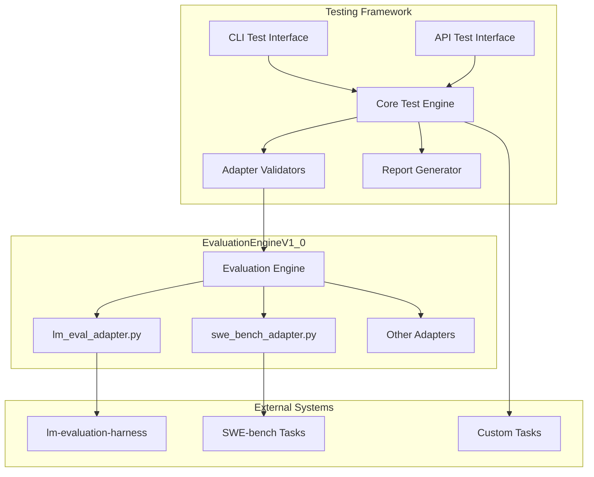

# Design Document

## Overview

This document outlines the design for a comprehensive testing framework for EvaluationEngineV1_0. The framework will provide both CLI and API testing interfaces, validate core adapters including lm_eval_adapter.py and swe_bench_adapter.py, and ensure complete end-to-end functionality validation through real execution scenarios.

## Architecture

### High-Level Architecture



### Component Architecture

The testing framework consists of five main components:

1. **CLI Test Interface**: Command-line testing capabilities
2. **API Test Interface**: REST API testing with curl support
3. **Core Test Engine**: Central orchestration and execution logic
4. **Adapter Validators**: Specialized validators for each adapter
5. **Report Generator**: Comprehensive result analysis and documentation

## Components and Interfaces

### 1. CLI Test Interface

**Purpose**: Provide command-line testing capabilities for automated and manual testing scenarios.

**Key Classes**:
- `CLITestRunner`: Main CLI test execution engine
- `CLIConfigManager`: Configuration management for CLI tests
- `CLIResultFormatter`: Output formatting and display

**Interface Design**:
```python
class CLITestRunner:
    def run_builtin_tasks(self, task_names: List[str], config: Dict) -> TestResults
    def run_custom_tasks(self, task_dir: Path, config: Dict) -> TestResults
    def run_adapter_tests(self, adapter_name: str, config: Dict) -> TestResults
    def run_full_pipeline(self, config: Dict) -> TestResults
```

**CLI Commands**:
- `test-cli builtin --tasks <task_list> --config <config_file>`
- `test-cli custom --task-dir <directory> --config <config_file>`
- `test-cli adapters --adapter <adapter_name> --config <config_file>`
- `test-cli pipeline --config <config_file>`

### 2. API Test Interface

**Purpose**: Provide REST API testing capabilities with curl command generation and execution.

**Key Classes**:
- `APITestServer`: Test API server implementation
- `CurlTestGenerator`: Generate curl commands for testing
- `APITestClient`: Programmatic API testing client
- `AsyncEvaluationManager`: Handle asynchronous evaluation requests

**Interface Design**:
```python
class APITestServer:
    def start_server(self, host: str, port: int) -> None
    def stop_server(self) -> None
    def register_endpoints(self) -> None

class CurlTestGenerator:
    def generate_evaluation_request(self, config: Dict) -> str
    def generate_status_check(self, evaluation_id: str) -> str
    def generate_result_retrieval(self, evaluation_id: str) -> str
```

**API Endpoints**:
- `POST /api/v1/evaluations` - Start evaluation
- `GET /api/v1/evaluations/{id}/status` - Check status
- `GET /api/v1/evaluations/{id}/results` - Get results
- `GET /api/v1/tasks` - List available tasks
- `GET /api/v1/adapters` - List available adapters

### 3. Core Test Engine

**Purpose**: Central orchestration of all testing activities with real execution validation.

**Key Classes**:
- `TestOrchestrator`: Main test coordination and execution
- `RealExecutionValidator`: Ensure no mock data is used
- `PipelineValidator`: End-to-end pipeline validation
- `MetricsCollector`: Performance and execution metrics

**Interface Design**:
```python
class TestOrchestrator:
    def execute_test_suite(self, suite_config: Dict) -> TestSuiteResults
    def validate_real_execution(self, test_result: Any) -> bool
    def collect_metrics(self, execution_context: Dict) -> ExecutionMetrics
    def generate_reports(self, results: TestSuiteResults) -> ReportSet
```

### 4. Adapter Validators

**Purpose**: Specialized validation for each core adapter with dependency management.

**Key Classes**:
- `LMEvalAdapterValidator`: Validate lm_eval_adapter.py integration
- `SWEBenchAdapterValidator`: Validate swe_bench_adapter.py integration
- `AdapterDependencyManager`: Handle adapter-specific dependencies
- `AdapterTestSuite`: Standardized adapter testing interface

**Interface Design**:
```python
class LMEvalAdapterValidator:
    def validate_integration(self) -> ValidationResult
    def test_builtin_tasks(self, task_count: int = 1) -> TestResults
    def test_custom_tasks(self, task_dir: Path) -> TestResults
    def install_dependencies(self) -> bool

class SWEBenchAdapterValidator:
    def validate_integration(self) -> ValidationResult
    def test_software_tasks(self, task_count: int = 1) -> TestResults
    def setup_environment(self) -> bool
    def install_dependencies(self) -> bool
```

### 5. Report Generator

**Purpose**: Generate comprehensive documentation and analysis reports.

**Key Classes**:
- `TestReportGenerator`: Main report generation engine
- `UsageDocumentationGenerator`: Generate usage.md documentation
- `APIDocumentationGenerator`: Generate API specifications
- `PerformanceAnalyzer`: Analyze execution performance

**Interface Design**:
```python
class TestReportGenerator:
    def generate_test_summary(self, results: TestSuiteResults) -> Report
    def generate_performance_report(self, metrics: ExecutionMetrics) -> Report
    def generate_adapter_validation_report(self, validations: List[ValidationResult]) -> Report

class UsageDocumentationGenerator:
    def generate_usage_guide(self, test_results: TestSuiteResults) -> str
    def generate_examples(self, successful_tests: List[TestResult]) -> str
    def generate_troubleshooting_guide(self, failed_tests: List[TestResult]) -> str
```

## Data Models

### Core Data Models

```python
@dataclass
class TestConfiguration:
    test_type: str  # 'cli', 'api', 'adapter', 'pipeline'
    target_adapters: List[str]
    task_selection: Dict[str, Any]
    execution_params: Dict[str, Any]
    output_config: Dict[str, Any]

@dataclass
class TestResult:
    test_id: str
    test_type: str
    status: str  # 'passed', 'failed', 'skipped'
    execution_time: float
    real_execution_validated: bool
    metrics: Dict[str, float]
    error_details: Optional[str]
    artifacts: List[str]

@dataclass
class ValidationResult:
    adapter_name: str
    integration_status: str
    dependencies_installed: bool
    test_results: List[TestResult]
    performance_metrics: Dict[str, float]
    issues_found: List[str]

@dataclass
class ExecutionMetrics:
    total_execution_time: float
    task_execution_times: Dict[str, float]
    memory_usage: Dict[str, float]
    api_response_times: Dict[str, float]
    error_rates: Dict[str, float]
    success_rates: Dict[str, float]
```

### Configuration Models

```python
@dataclass
class CLITestConfig:
    tasks: List[str]
    adapters: List[str]
    execution_timeout: int
    output_format: str
    verbose: bool

@dataclass
class APITestConfig:
    server_host: str
    server_port: int
    test_endpoints: List[str]
    concurrent_requests: int
    timeout: int

@dataclass
class AdapterTestConfig:
    adapter_name: str
    test_task_count: int
    dependency_check: bool
    performance_benchmark: bool
    custom_task_dir: Optional[str]
```

## Error Handling

### Error Classification

1. **Configuration Errors**: Invalid test configurations
2. **Dependency Errors**: Missing or incompatible dependencies
3. **Execution Errors**: Runtime failures during test execution
4. **Validation Errors**: Failed validation of real execution
5. **Integration Errors**: Adapter integration failures

### Error Handling Strategy

```python
class TestFrameworkError(Exception):
    """Base exception for testing framework"""
    pass

class ConfigurationError(TestFrameworkError):
    """Configuration validation errors"""
    pass

class DependencyError(TestFrameworkError):
    """Dependency installation/validation errors"""
    pass

class ExecutionError(TestFrameworkError):
    """Test execution errors"""
    pass

class ValidationError(TestFrameworkError):
    """Real execution validation errors"""
    pass
```

### Error Recovery

- **Graceful Degradation**: Continue with available tests when some fail
- **Retry Logic**: Automatic retry for transient failures
- **Detailed Logging**: Comprehensive error context and stack traces
- **User Guidance**: Clear error messages with resolution suggestions

## Testing Strategy

### Test Categories

1. **Unit Tests**: Individual component validation
2. **Integration Tests**: Adapter integration validation
3. **End-to-End Tests**: Complete pipeline validation
4. **Performance Tests**: Execution performance validation
5. **Regression Tests**: Prevent functionality regression

### Test Execution Patterns

1. **Sequential Execution**: For resource-intensive tests
2. **Parallel Execution**: For independent test suites
3. **Conditional Execution**: Based on dependency availability
4. **Incremental Execution**: Build on previous test results

### Real Execution Validation

```python
class RealExecutionValidator:
    def validate_no_mocks(self, execution_context: Dict) -> bool:
        """Ensure no mock objects or simulated data"""
        
    def validate_actual_model_calls(self, api_logs: List[Dict]) -> bool:
        """Verify real model API calls were made"""
        
    def validate_genuine_results(self, results: Any) -> bool:
        """Confirm results are from actual evaluation"""
        
    def validate_resource_consumption(self, metrics: ExecutionMetrics) -> bool:
        """Verify realistic resource usage patterns"""
```

## Implementation Plan

### Phase 1: Core Infrastructure (Requirements 1, 4, 5)
- Implement core test engine and orchestrator
- Create organized directory structure
- Implement configuration management
- Set up logging and error handling

### Phase 2: CLI Testing Interface (Requirement 1)
- Implement CLI test runner
- Create command-line interface
- Add configuration file support
- Implement result formatting

### Phase 3: API Testing Interface (Requirement 2)
- Implement API test server
- Create curl command generation
- Add asynchronous request handling
- Implement API client testing

### Phase 4: Adapter Validation (Requirement 3)
- Implement lm_eval_adapter validator
- Implement swe_bench_adapter validator
- Add dependency management
- Create adapter test suites

### Phase 5: Real Execution Validation (Requirement 6)
- Implement real execution validators
- Add mock detection mechanisms
- Create performance benchmarks
- Validate resource consumption

### Phase 6: Custom Task Support (Requirement 7)
- Implement custom task discovery
- Add task format validation
- Create extensible task loading
- Support multiple task structures

### Phase 7: Documentation Generation (Requirement 8)
- Implement report generators
- Create usage documentation
- Generate API specifications
- Add troubleshooting guides

## Security Considerations

### Execution Safety
- **Sandboxed Execution**: Isolate test execution environments
- **Resource Limits**: Prevent resource exhaustion
- **Command Validation**: Validate all executed commands
- **File System Protection**: Restrict file system access

### API Security
- **Authentication**: Secure API endpoints
- **Rate Limiting**: Prevent API abuse
- **Input Validation**: Validate all API inputs
- **Error Information**: Limit error information exposure

### Data Protection
- **Sensitive Data**: Protect API keys and credentials
- **Result Storage**: Secure test result storage
- **Log Sanitization**: Remove sensitive information from logs
- **Temporary Files**: Secure cleanup of temporary files

## Performance Considerations

### Optimization Strategies
- **Parallel Execution**: Run independent tests concurrently
- **Resource Pooling**: Reuse expensive resources
- **Caching**: Cache test results and dependencies
- **Lazy Loading**: Load components only when needed

### Scalability
- **Horizontal Scaling**: Support distributed test execution
- **Resource Management**: Efficient resource allocation
- **Load Balancing**: Distribute test load effectively
- **Monitoring**: Track performance metrics

### Memory Management
- **Memory Limits**: Set appropriate memory limits
- **Garbage Collection**: Efficient memory cleanup
- **Resource Cleanup**: Proper resource disposal
- **Memory Profiling**: Monitor memory usage patterns