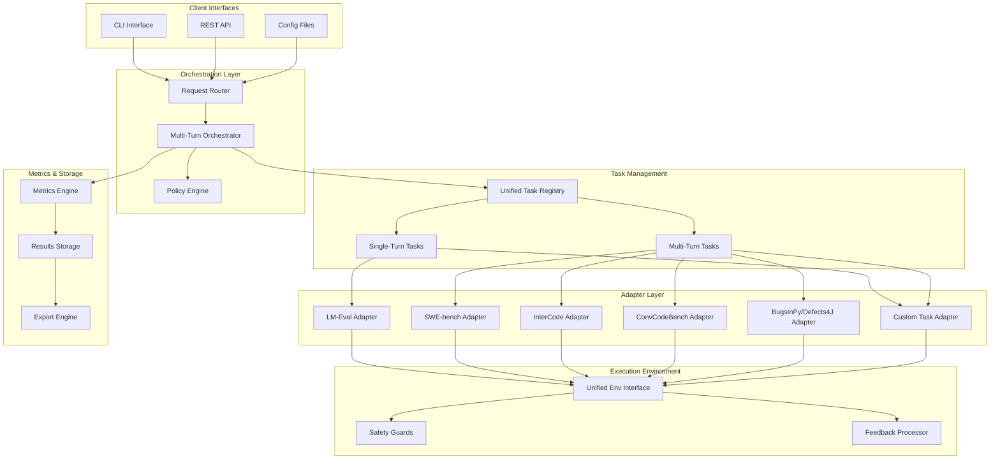

# Multi-Turn Evaluation Engine Design

## Overview

This document outlines the design for enhancing the existing evaluation engine to support unified single-turn and multi-turn evaluation capabilities. The design builds upon the existing `evaluation_engine` architecture and `lm-evaluation-harness` integration while introducing a new orchestration layer for multi-turn scenarios.

## Architecture

### High-Level System Architecture



### Core Components

#### 1. Unified Task Type System

The system defines two primary task type classes that inherit from a common base:

```python
class BaseTask(ABC):
    """Base class for all evaluation tasks"""
    
    @abstractmethod
    def get_task_type(self) -> TaskType
    
    @abstractmethod
    def validate_config(self, config: Dict[str, Any]) -> bool
    
    @abstractmethod
    def get_required_capabilities(self) -> List[str]

class SingleTurnTask(BaseTask):
    """Single-turn evaluation task"""
    
    def get_task_type(self) -> TaskType:
        return TaskType.SINGLE_TURN
    
    def execute(self, input_data: Any) -> TaskResult:
        """Execute single-turn evaluation"""
        pass

class MultiTurnTask(BaseTask):
    """Multi-turn evaluation task with conversation state"""
    
    def get_task_type(self) -> TaskType:
        return TaskType.MULTI_TURN
    
    def execute_turn(self, turn_data: TurnData) -> TurnResult:
        """Execute a single turn in multi-turn evaluation"""
        pass
    
    def should_continue(self, turn_result: TurnResult) -> bool:
        """Determine if evaluation should continue"""
        pass
```

#### 2. Unified Environment Interface

All tasks, regardless of source, implement a standardized environment interface:

```python
class UnifiedEnv(ABC):
    """Unified environment interface for all evaluation tasks"""
    
    @abstractmethod
    def reset(self) -> Observation:
        """Reset environment to initial state"""
        pass
    
    @abstractmethod
    def step(self, action: Action) -> Tuple[Observation, Reward, bool, Dict[str, Any]]:
        """Execute action and return (observation, reward, done, info)"""
        pass
    
    @abstractmethod
    def success(self) -> bool:
        """Check if task has been completed successfully"""
        pass
    
    @abstractmethod
    def info(self) -> Dict[str, Any]:
        """Get current environment information and metadata"""
        pass
    
    @abstractmethod
    def get_metrics(self) -> Dict[str, float]:
        """Get current performance metrics"""
        pass
```

#### 3. Multi-Turn Orchestrator

The orchestrator manages the execution flow for multi-turn evaluations:

```python
class MultiTurnOrchestrator:
    """Orchestrates multi-turn evaluation execution"""
    
    def __init__(self, 
                 policy_engine: PolicyEngine,
                 feedback_processor: FeedbackProcessor,
                 safety_guard: SafetyGuard,
                 metrics_engine: MetricsEngine):
        self.policy_engine = policy_engine
        self.feedback_processor = feedback_processor
        self.safety_guard = safety_guard
        self.metrics_engine = metrics_engine
    
    async def execute_evaluation(self, 
                               task: MultiTurnTask,
                               model: ModelAdapter,
                               config: EvaluationConfig) -> EvaluationResult:
        """Execute complete multi-turn evaluation"""
        
        # Initialize environment
        env = task.create_environment()
        observation = env.reset()
        
        turn_results = []
        turn_count = 0
        
        while turn_count < config.max_turns:
            # Safety check
            if not self.safety_guard.is_safe_to_continue(env, observation):
                break
            
            # Generate action using model
            action = await model.generate_action(observation, turn_results)
            
            # Execute action
            observation, reward, done, info = env.step(action)
            
            # Process feedback
            processed_feedback = self.feedback_processor.process(
                observation, info, config.feedback_config
            )
            
            # Record turn result
            turn_result = TurnResult(
                turn=turn_count + 1,
                action=action,
                observation=observation,
                reward=reward,
                done=done,
                info=info,
                processed_feedback=processed_feedback
            )
            turn_results.append(turn_result)
            
            # Check termination conditions
            if done or env.success():
                break
            
            # Policy-based termination check
            if self.policy_engine.should_terminate(turn_results, env):
                break
            
            turn_count += 1
        
        # Calculate final metrics
        metrics = self.metrics_engine.calculate_metrics(turn_results, env)
        
        return EvaluationResult(
            task_id=task.get_id(),
            turn_results=turn_results,
            final_metrics=metrics,
            success=env.success(),
            total_turns=turn_count + 1
        )
```

#### 4. Adapter Architecture

Each external benchmark tool is integrated through a dedicated adapter:

```python
class BenchmarkAdapter(ABC):
    """Base class for benchmark tool adapters"""
    
    @abstractmethod
    def create_environment(self, task_config: Dict[str, Any]) -> UnifiedEnv:
        """Create environment instance for the benchmark"""
        pass
    
    @abstractmethod
    def load_tasks(self, task_filter: Optional[Dict[str, Any]] = None) -> List[Task]:
        """Load available tasks from the benchmark"""
        pass
    
    @abstractmethod
    def convert_results(self, results: Any) -> StandardizedResult:
        """Convert benchmark-specific results to standardized format"""
        pass

class SWEBenchAdapter(BenchmarkAdapter):
    """Adapter for SWE-bench integration"""
    
    def create_environment(self, task_config: Dict[str, Any]) -> UnifiedEnv:
        return SWEBenchEnvironment(task_config)
    
    def load_tasks(self, task_filter: Optional[Dict[str, Any]] = None) -> List[Task]:
        # Load SWE-bench tasks with filtering
        pass

class InterCodeAdapter(BenchmarkAdapter):
    """Adapter for InterCode integration"""
    
    def create_environment(self, task_config: Dict[str, Any]) -> UnifiedEnv:
        return InterCodeEnvironment(task_config)
```

## Components and Interfaces

### 1. Task Registry Enhancement

The existing `ExtendedTaskRegistry` is enhanced to support the unified task type system:

```python
class UnifiedTaskRegistry(ExtendedTaskRegistry):
    """Enhanced registry supporting both single-turn and multi-turn tasks"""
    
    def __init__(self):
        super().__init__()
        self.adapters: Dict[str, BenchmarkAdapter] = {}
        self.task_type_mapping: Dict[str, TaskType] = {}
    
    def register_adapter(self, name: str, adapter: BenchmarkAdapter):
        """Register a benchmark adapter"""
        self.adapters[name] = adapter
        
        # Auto-discover tasks from adapter
        tasks = adapter.load_tasks()
        for task in tasks:
            self.register_task_from_adapter(task, adapter)
    
    def get_task_by_type(self, task_type: TaskType) -> List[str]:
        """Get all tasks of a specific type"""
        return [name for name, t_type in self.task_type_mapping.items() 
                if t_type == task_type]
    
    def create_task_instance(self, task_name: str, config: Dict[str, Any]) -> BaseTask:
        """Create task instance with appropriate adapter"""
        # Determine which adapter to use
        adapter = self._get_adapter_for_task(task_name)
        
        if adapter:
            env = adapter.create_environment(config)
            if self.task_type_mapping[task_name] == TaskType.MULTI_TURN:
                return MultiTurnTaskWrapper(task_name, env, config)
            else:
                return SingleTurnTaskWrapper(task_name, env, config)
        else:
            # Use existing lm-eval task loading
            return self._load_lm_eval_task(task_name, config)
```

### 2. Feedback Processing System

The feedback processor handles context management and safety filtering:

```python
class FeedbackProcessor:
    """Processes and shapes feedback for multi-turn evaluations"""
    
    def __init__(self, config: FeedbackConfig):
        self.config = config
        self.context_manager = ContextManager(config.max_context_length)
        self.safety_filter = SafetyFilter(config.safety_rules)
    
    def process(self, 
                observation: Observation, 
                info: Dict[str, Any],
                config: FeedbackConfig) -> ProcessedFeedback:
        """Process raw feedback into structured format"""
        
        # Extract key information
        feedback_data = {
            'stdout': info.get('stdout', ''),
            'stderr': info.get('stderr', ''),
            'files_changed': info.get('files_changed', []),
            'test_results': info.get('test_results', {}),
            'execution_time': info.get('execution_time', 0)
        }
        
        # Apply safety filtering
        filtered_data = self.safety_filter.filter(feedback_data)
        
        # Apply context management
        contextualized_data = self.context_manager.contextualize(
            filtered_data, config.context_strategy
        )
        
        # Apply length limits
        truncated_data = self._apply_length_limits(
            contextualized_data, config.max_feedback_length
        )
        
        return ProcessedFeedback(
            original=feedback_data,
            filtered=filtered_data,
            contextualized=contextualized_data,
            final=truncated_data
        )
    
    def _apply_length_limits(self, data: Dict[str, Any], max_length: int) -> Dict[str, Any]:
        """Apply length truncation while preserving essential information"""
        # Implementation for intelligent truncation
        pass
```

### 3. Safety Guard System

The safety system provides multiple layers of protection:

```python
class SafetyGuard:
    """Multi-layered safety system for evaluation execution"""
    
    def __init__(self, config: SafetyConfig):
        self.tool_whitelist = set(config.allowed_tools)
        self.resource_monitor = ResourceMonitor(config.resource_limits)
        self.command_filter = CommandFilter(config.dangerous_patterns)
        self.incident_logger = IncidentLogger()
    
    def is_safe_to_continue(self, env: UnifiedEnv, observation: Observation) -> bool:
        """Check if it's safe to continue evaluation"""
        
        # Check resource usage
        if not self.resource_monitor.within_limits():
            self.incident_logger.log_incident("Resource limits exceeded")
            return False
        
        # Check for dangerous patterns in observation
        if self.command_filter.contains_dangerous_content(observation):
            self.incident_logger.log_incident("Dangerous content detected")
            return False
        
        return True
    
    def validate_action(self, action: Action) -> Tuple[bool, Optional[str]]:
        """Validate action before execution"""
        
        # Check tool whitelist
        if hasattr(action, 'tool') and action.tool not in self.tool_whitelist:
            return False, f"Tool {action.tool} not in whitelist"
        
        # Check for dangerous commands
        if self.command_filter.is_dangerous_command(action):
            return False, "Dangerous command detected"
        
        return True, None
```

## Data Models

### Core Data Structures

```python
@dataclass
class TurnData:
    """Data for a single turn in multi-turn evaluation"""
    turn_number: int
    input_context: str
    previous_actions: List[Action]
    environment_state: Dict[str, Any]
    timestamp: datetime

@dataclass
class TurnResult:
    """Result of a single turn execution"""
    turn: int
    action: Action
    observation: Observation
    reward: float
    done: bool
    info: Dict[str, Any]
    processed_feedback: ProcessedFeedback
    execution_time: float
    tokens_used: int
    cost: float

@dataclass
class EvaluationResult:
    """Complete evaluation result"""
    evaluation_id: str
    task_id: str
    model_id: str
    start_time: datetime
    end_time: datetime
    success: bool
    total_turns: int
    turn_results: List[TurnResult]
    final_metrics: Dict[str, float]
    aggregated_metrics: AggregatedMetrics
    metadata: Dict[str, Any]

@dataclass
class AggregatedMetrics:
    """Aggregated metrics across all evaluation dimensions"""
    # Task Success Metrics
    resolved_percentage: float
    recall: float
    mrr: float
    
    # Efficiency Metrics
    avg_turns: float
    avg_steps: float
    redundancy_rate: float
    
    # Repair Quality Metrics
    edit_churn: float
    files_touched: int
    
    # Robustness Metrics
    recovery_rate: float
    stability_score: float
    
    # Cost Metrics
    wall_time_per_solved: float
    tokens_per_solved: int
    cost_per_solved: float
    
    # Safety Metrics
    safety_incidents: int
    policy_violations: int
```

### Configuration Models

```python
@dataclass
class MultiTurnConfig:
    """Configuration for multi-turn evaluation"""
    max_turns: int = 10
    conversation_timeout: int = 3600  # seconds
    enable_context_retention: bool = True
    termination_conditions: List[str] = field(default_factory=lambda: ["success", "max_turns", "timeout"])
    feedback_config: FeedbackConfig = field(default_factory=FeedbackConfig)
    safety_config: SafetyConfig = field(default_factory=SafetyConfig)

@dataclass
class FeedbackConfig:
    """Configuration for feedback processing"""
    max_feedback_length: int = 10000
    context_strategy: str = "adaptive"  # "full", "adaptive", "minimal"
    max_context_length: int = 50000
    enable_stack_summarization: bool = True
    enable_file_context: bool = True
    top_k_assertions: int = 5

@dataclass
class SafetyConfig:
    """Configuration for safety controls"""
    allowed_tools: List[str] = field(default_factory=lambda: ["python", "bash", "git"])
    resource_limits: Dict[str, Any] = field(default_factory=dict)
    dangerous_patterns: List[str] = field(default_factory=list)
    enable_sandboxing: bool = True
    max_execution_time: int = 300  # seconds per action
```

## Error Handling

### Error Classification and Recovery

```python
class EvaluationError(Exception):
    """Base class for evaluation errors"""
    
    def __init__(self, message: str, error_type: str, recoverable: bool = False):
        super().__init__(message)
        self.error_type = error_type
        self.recoverable = recoverable
        self.timestamp = datetime.now()

class TaskExecutionError(EvaluationError):
    """Error during task execution"""
    pass

class SafetyViolationError(EvaluationError):
    """Safety policy violation"""
    
    def __init__(self, message: str, violation_type: str):
        super().__init__(message, "safety_violation", recoverable=False)
        self.violation_type = violation_type

class ResourceExhaustionError(EvaluationError):
    """Resource limits exceeded"""
    pass

class ErrorHandler:
    """Centralized error handling and recovery"""
    
    def handle_error(self, error: EvaluationError, context: Dict[str, Any]) -> ErrorResponse:
        """Handle evaluation error with appropriate recovery strategy"""
        
        if isinstance(error, SafetyViolationError):
            return self._handle_safety_violation(error, context)
        elif isinstance(error, ResourceExhaustionError):
            return self._handle_resource_exhaustion(error, context)
        elif error.recoverable:
            return self._attempt_recovery(error, context)
        else:
            return self._fail_gracefully(error, context)
    
    def _handle_safety_violation(self, error: SafetyViolationError, context: Dict[str, Any]) -> ErrorResponse:
        """Handle safety violations by immediate termination"""
        return ErrorResponse(
            action="terminate",
            reason=f"Safety violation: {error.violation_type}",
            allow_retry=False
        )
```

## Testing Strategy

### Unit Testing

- **Task Type System**: Test single-turn and multi-turn task classification and execution
- **Adapter Layer**: Test each benchmark adapter independently with mock environments
- **Orchestrator**: Test turn management, termination conditions, and state handling
- **Safety System**: Test all safety guards and policy enforcement
- **Metrics Engine**: Test metric calculation accuracy and aggregation

### Integration Testing

- **End-to-End Workflows**: Test complete evaluation flows for both single-turn and multi-turn scenarios
- **Adapter Integration**: Test real integration with external benchmark tools
- **API Compatibility**: Test backward compatibility with existing lm-eval tasks
- **Performance Testing**: Test system performance under load with concurrent evaluations

### Test Data and Scenarios

```python
class TestScenarios:
    """Comprehensive test scenarios for multi-turn evaluation"""
    
    @staticmethod
    def create_simple_multi_turn_scenario() -> MultiTurnTask:
        """Create a simple multi-turn coding task for testing"""
        pass
    
    @staticmethod
    def create_safety_violation_scenario() -> MultiTurnTask:
        """Create scenario that triggers safety violations"""
        pass
    
    @staticmethod
    def create_resource_exhaustion_scenario() -> MultiTurnTask:
        """Create scenario that exhausts system resources"""
        pass
    
    @staticmethod
    def create_adapter_compatibility_tests() -> List[TestCase]:
        """Create tests for adapter compatibility"""
        pass
```

### Performance Benchmarks

- **Throughput**: Measure evaluations per hour for different task types
- **Latency**: Measure response times for API calls and task execution
- **Resource Usage**: Monitor CPU, memory, and disk usage during evaluations
- **Scalability**: Test system behavior with increasing concurrent evaluations

## Implementation Phases

### Phase 1: Core Infrastructure (Weeks 1-2)
- Implement unified task type system
- Create base orchestrator framework
- Implement unified environment interface
- Set up basic safety guards

### Phase 2: Adapter Development (Weeks 3-4)
- Implement lm-eval compatibility adapter
- Create SWE-bench adapter
- Implement InterCode adapter
- Basic testing and validation

### Phase 3: Advanced Features (Weeks 5-6)
- Implement comprehensive metrics system
- Add feedback processing and context management
- Enhance safety system with advanced policies
- Implement export and reporting features

### Phase 4: Integration and Testing (Weeks 7-8)
- Complete integration testing
- Performance optimization
- Documentation and examples
- Backward compatibility validation

This design provides a comprehensive foundation for implementing the multi-turn evaluation engine while maintaining compatibility with existing systems and ensuring robust, secure operation.