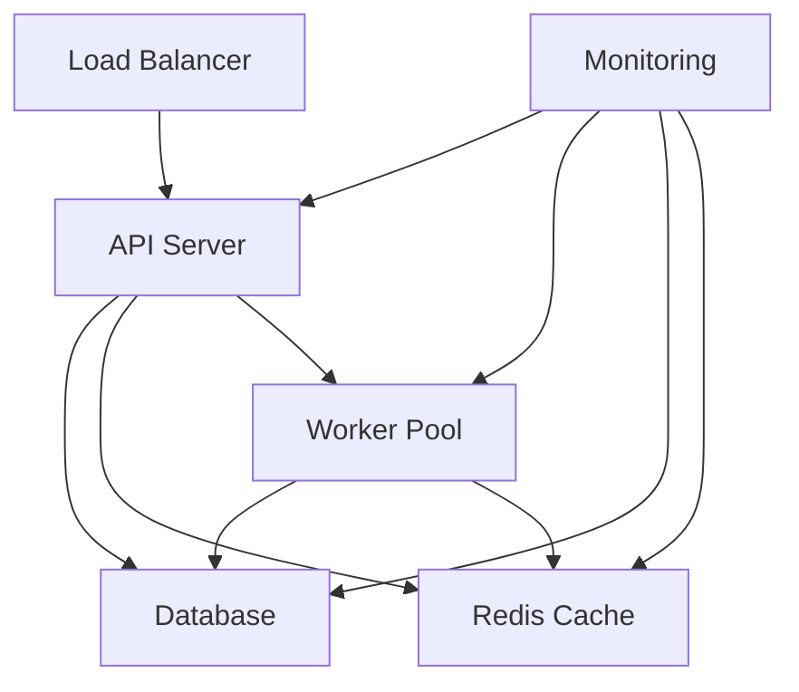

# Multi-Turn Evaluation Engine Operations Manual

This manual provides operational procedures, monitoring guidelines, and troubleshooting information for the Multi-Turn Evaluation Engine in production environments.

## Table of Contents

1. [System Overview](#system-overview)
2. [Monitoring and Alerting](#monitoring-and-alerting)
3. [Performance Management](#performance-management)
4. [Incident Response](#incident-response)
5. [Maintenance Procedures](#maintenance-procedures)
6. [Backup and Recovery](#backup-and-recovery)
7. [Security Operations](#security-operations)
8. [Capacity Planning](#capacity-planning)
9. [Runbooks](#runbooks)

## System Overview

### Architecture Components

- **API Server**: Handles HTTP requests and WebSocket connections
- **Worker Processes**: Execute evaluation tasks
- **Database**: PostgreSQL for persistent data storage
- **Cache**: Redis for session storage and caching
- **Message Queue**: Redis for task distribution
- **Monitoring**: Prometheus, Grafana, and alerting systems

### Service Dependencies



### Key Metrics

- **Availability**: Target 99.9% uptime
- **Response Time**: P95 < 2 seconds
- **Throughput**: 1000+ evaluations per hour
- **Error Rate**: < 0.1% for 5xx errors

## Monitoring and Alerting

### Critical Alerts

#### Service Availability
- **EvaluationEngineDown**: API service is unreachable
- **DatabaseDown**: PostgreSQL is unavailable
- **CacheDown**: Redis is unavailable
- **WorkerDown**: No workers are processing tasks

#### Performance Degradation
- **HighResponseTime**: P95 response time > 2 seconds
- **HighErrorRate**: Error rate > 5%
- **HighMemoryUsage**: Memory usage > 85%
- **HighCPUUsage**: CPU usage > 80%

#### Business Logic
- **EvaluationFailures**: High evaluation failure rate
- **QueueBacklog**: Large number of pending evaluations
- **LowCacheHitRate**: Cache performance degradation

### Monitoring Dashboards

#### System Overview Dashboard
- Service health status
- Request rate and response times
- Error rates and types
- Resource utilization

#### Performance Dashboard
- Evaluation throughput
- Queue depths and processing times
- Cache hit rates
- Database performance metrics

#### Infrastructure Dashboard
- CPU, memory, disk, and network usage
- Container and pod status
- Kubernetes cluster health
- Storage utilization

### Alert Escalation

1. **Level 1 (Warning)**: Automated remediation, team notification
2. **Level 2 (Critical)**: Immediate team notification, escalation after 15 minutes
3. **Level 3 (Emergency)**: Immediate escalation to on-call engineer and management

## Performance Management

### Performance Baselines

| Metric | Target | Warning | Critical |
|--------|--------|---------|----------|
| Response Time (P95) | < 1s | > 2s | > 5s |
| Error Rate | < 0.01% | > 0.1% | > 1% |
| CPU Usage | < 50% | > 80% | > 95% |
| Memory Usage | < 70% | > 85% | > 95% |
| Disk Usage | < 70% | > 85% | > 95% |
| Cache Hit Rate | > 80% | < 60% | < 40% |

### Performance Optimization

#### Database Optimization
```sql
-- Monitor slow queries
SELECT query, mean_time, calls, total_time
FROM pg_stat_statements
ORDER BY mean_time DESC
LIMIT 10;

-- Check index usage
SELECT schemaname, tablename, attname, n_distinct, correlation
FROM pg_stats
WHERE schemaname = 'public'
ORDER BY n_distinct DESC;
```

#### Cache Optimization
```bash
# Monitor Redis performance
redis-cli info stats
redis-cli info memory
redis-cli slowlog get 10
```

#### Application Performance
```bash
# Check application metrics
curl http://localhost:9090/metrics | grep -E "(response_time|error_rate|throughput)"

# Monitor resource usage
kubectl top pods -n evaluation-engine
kubectl top nodes
```

### Capacity Planning

#### Scaling Triggers
- **Scale Up**: CPU > 70% for 10 minutes OR Memory > 80% for 10 minutes
- **Scale Down**: CPU < 30% for 30 minutes AND Memory < 50% for 30 minutes

#### Resource Allocation
```yaml
# Production resource limits
resources:
  requests:
    cpu: 1000m
    memory: 2Gi
  limits:
    cpu: 4000m
    memory: 8Gi
```

## Incident Response

### Incident Classification

#### Severity Levels
- **P0 (Critical)**: Complete service outage, data loss
- **P1 (High)**: Major functionality impaired, significant user impact
- **P2 (Medium)**: Minor functionality impaired, limited user impact
- **P3 (Low)**: Cosmetic issues, no user impact

### Response Procedures

#### P0/P1 Incident Response
1. **Immediate Response** (0-5 minutes)
   - Acknowledge alert
   - Assess impact and scope
   - Initiate incident response

2. **Investigation** (5-15 minutes)
   - Check system status
   - Review recent changes
   - Identify root cause

3. **Mitigation** (15-30 minutes)
   - Implement immediate fixes
   - Scale resources if needed
   - Communicate status

4. **Resolution** (30+ minutes)
   - Apply permanent fix
   - Verify system stability
   - Document incident

### Communication Templates

#### Initial Alert
```
🚨 INCIDENT ALERT - P1
Service: Multi-Turn Evaluation Engine
Issue: High error rate detected
Impact: Users experiencing evaluation failures
Status: Investigating
ETA: 15 minutes
```

#### Status Update
```
📊 INCIDENT UPDATE - P1
Service: Multi-Turn Evaluation Engine
Issue: Database connection pool exhausted
Action: Scaling database connections
Status: Implementing fix
ETA: 10 minutes
```

#### Resolution
```
✅ INCIDENT RESOLVED - P1
Service: Multi-Turn Evaluation Engine
Issue: Database connection pool exhausted
Resolution: Increased connection pool size and added monitoring
Duration: 45 minutes
Post-mortem: Will be published within 24 hours
```

## Maintenance Procedures

### Regular Maintenance Tasks

#### Daily
- [ ] Check system health dashboards
- [ ] Review error logs for anomalies
- [ ] Verify backup completion
- [ ] Monitor resource utilization trends

#### Weekly
- [ ] Review performance metrics
- [ ] Check security alerts
- [ ] Update documentation
- [ ] Test alerting systems

#### Monthly
- [ ] Security patches and updates
- [ ] Capacity planning review
- [ ] Disaster recovery testing
- [ ] Performance optimization review

### Deployment Procedures

#### Rolling Deployment
```bash
# Update deployment with zero downtime
kubectl set image deployment/evaluation-engine \
  evaluation-engine=evaluation-engine:v1.2.0 \
  -n evaluation-engine

# Monitor rollout
kubectl rollout status deployment/evaluation-engine -n evaluation-engine

# Rollback if needed
kubectl rollout undo deployment/evaluation-engine -n evaluation-engine
```

#### Blue-Green Deployment
```bash
# Deploy to green environment
kubectl apply -f deployment-green.yaml

# Test green environment
curl -f http://green.evaluation-engine.internal/health

# Switch traffic
kubectl patch service evaluation-engine-service \
  -p '{"spec":{"selector":{"version":"green"}}}'

# Monitor and rollback if needed
kubectl patch service evaluation-engine-service \
  -p '{"spec":{"selector":{"version":"blue"}}}'
```

### Database Maintenance

#### Regular Tasks
```sql
-- Update statistics
ANALYZE;

-- Vacuum tables
VACUUM ANALYZE;

-- Check for bloat
SELECT schemaname, tablename, 
       pg_size_pretty(pg_total_relation_size(schemaname||'.'||tablename)) as size
FROM pg_tables 
WHERE schemaname = 'public'
ORDER BY pg_total_relation_size(schemaname||'.'||tablename) DESC;
```

#### Index Maintenance
```sql
-- Rebuild indexes if needed
REINDEX INDEX CONCURRENTLY idx_evaluations_created_at;

-- Check index usage
SELECT schemaname, tablename, indexname, idx_scan, idx_tup_read, idx_tup_fetch
FROM pg_stat_user_indexes
ORDER BY idx_scan DESC;
```

## Backup and Recovery

### Backup Procedures

#### Database Backups
```bash
#!/bin/bash
# Daily database backup
BACKUP_DIR="/backups/postgres"
DATE=$(date +%Y%m%d_%H%M%S)
RETENTION_DAYS=30

# Create backup
pg_dump -h $DB_HOST -U $DB_USER -d $DB_NAME \
  --verbose --no-owner --no-privileges \
  > $BACKUP_DIR/backup_$DATE.sql

# Compress backup
gzip $BACKUP_DIR/backup_$DATE.sql

# Upload to cloud storage
aws s3 cp $BACKUP_DIR/backup_$DATE.sql.gz \
  s3://evaluation-engine-backups/postgres/

# Clean old backups
find $BACKUP_DIR -name "backup_*.sql.gz" -mtime +$RETENTION_DAYS -delete
```

#### Application Data Backups
```bash
#!/bin/bash
# Backup evaluation results and configurations
kubectl create job backup-$(date +%Y%m%d-%H%M%S) \
  --from=cronjob/backup-job -n evaluation-engine

# Backup Kubernetes configurations
kubectl get all,configmap,secret,pvc -n evaluation-engine -o yaml \
  > k8s-backup-$(date +%Y%m%d).yaml
```

### Recovery Procedures

#### Database Recovery
```bash
# Point-in-time recovery
pg_restore -h $DB_HOST -U $DB_USER -d $DB_NAME \
  --verbose --clean --if-exists backup_file.sql

# Verify data integrity
psql -h $DB_HOST -U $DB_USER -d $DB_NAME \
  -c "SELECT COUNT(*) FROM evaluations;"
```

#### Application Recovery
```bash
# Restore from backup
kubectl apply -f k8s-backup.yaml

# Verify services
kubectl get pods -n evaluation-engine
kubectl get services -n evaluation-engine
```

## Security Operations

### Security Monitoring

#### Key Security Metrics
- Failed authentication attempts
- Unauthorized API access attempts
- Suspicious request patterns
- Certificate expiration dates

#### Security Alerts
```bash
# Monitor failed logins
kubectl logs -f deployment/evaluation-engine | grep "authentication failed"

# Check for suspicious activity
kubectl logs -f deployment/evaluation-engine | grep -E "(401|403|429)"

# Monitor certificate expiration
openssl x509 -in /etc/ssl/certs/evaluation-engine.crt -noout -dates
```

### Security Procedures

#### Certificate Renewal
```bash
# Renew Let's Encrypt certificates
certbot renew --dry-run

# Update Kubernetes secrets
kubectl create secret tls evaluation-engine-tls \
  --cert=path/to/cert.pem \
  --key=path/to/key.pem \
  --dry-run=client -o yaml | kubectl apply -f -
```

#### Security Patching
```bash
# Update base images
docker pull python:3.11-slim
docker build -t evaluation-engine:latest .

# Update Kubernetes deployments
kubectl set image deployment/evaluation-engine \
  evaluation-engine=evaluation-engine:latest
```

## Capacity Planning

### Resource Monitoring

#### CPU and Memory Trends
```bash
# Get resource usage trends
kubectl top pods -n evaluation-engine --sort-by=cpu
kubectl top pods -n evaluation-engine --sort-by=memory

# Historical data from Prometheus
curl -G 'http://prometheus:9090/api/v1/query_range' \
  --data-urlencode 'query=rate(container_cpu_usage_seconds_total[5m])' \
  --data-urlencode 'start=2023-01-01T00:00:00Z' \
  --data-urlencode 'end=2023-01-02T00:00:00Z' \
  --data-urlencode 'step=300s'
```

#### Storage Growth
```bash
# Monitor database size
psql -h $DB_HOST -U $DB_USER -d $DB_NAME \
  -c "SELECT pg_size_pretty(pg_database_size('evaluation_engine'));"

# Monitor persistent volume usage
kubectl get pvc -n evaluation-engine
df -h /app/results
```

### Scaling Decisions

#### Horizontal Scaling
```yaml
# Auto-scaling configuration
apiVersion: autoscaling/v2
kind: HorizontalPodAutoscaler
metadata:
  name: evaluation-engine-hpa
spec:
  scaleTargetRef:
    apiVersion: apps/v1
    kind: Deployment
    name: evaluation-engine
  minReplicas: 3
  maxReplicas: 20
  metrics:
  - type: Resource
    resource:
      name: cpu
      target:
        type: Utilization
        averageUtilization: 70
```

#### Vertical Scaling
```bash
# Update resource limits
kubectl patch deployment evaluation-engine -p \
  '{"spec":{"template":{"spec":{"containers":[{"name":"evaluation-engine","resources":{"limits":{"cpu":"4","memory":"8Gi"},"requests":{"cpu":"2","memory":"4Gi"}}}]}}}}'
```

## Runbooks

### Common Issues and Solutions

#### Service Won't Start
```bash
# Check pod status
kubectl get pods -n evaluation-engine

# Check logs
kubectl logs -f deployment/evaluation-engine -n evaluation-engine

# Check configuration
kubectl describe configmap evaluation-engine-config -n evaluation-engine

# Common fixes:
# 1. Check database connectivity
# 2. Verify secrets are properly set
# 3. Check resource limits
# 4. Verify image availability
```

#### High Memory Usage
```bash
# Identify memory-intensive pods
kubectl top pods -n evaluation-engine --sort-by=memory

# Check for memory leaks
kubectl exec -it <pod-name> -- ps aux --sort=-%mem

# Restart affected pods
kubectl delete pod <pod-name> -n evaluation-engine

# Scale up if needed
kubectl scale deployment evaluation-engine --replicas=5
```

#### Database Connection Issues
```bash
# Check database status
kubectl get pods -l app=postgres -n evaluation-engine

# Test connectivity
kubectl run -it --rm debug --image=postgres:15 --restart=Never -- \
  psql -h postgres-service -U eval_user -d evaluation_engine

# Check connection pool
psql -h $DB_HOST -U $DB_USER -d $DB_NAME \
  -c "SELECT * FROM pg_stat_activity WHERE state = 'active';"

# Common fixes:
# 1. Restart database pod
# 2. Increase connection pool size
# 3. Check network policies
# 4. Verify credentials
```

#### Cache Performance Issues
```bash
# Check Redis status
kubectl exec -it redis-0 -- redis-cli info

# Monitor cache hit rate
kubectl exec -it redis-0 -- redis-cli info stats | grep hit_rate

# Check memory usage
kubectl exec -it redis-0 -- redis-cli info memory

# Common fixes:
# 1. Increase cache memory
# 2. Optimize cache keys
# 3. Implement cache warming
# 4. Check for cache stampede
```

### Emergency Procedures

#### Complete Service Outage
1. **Immediate Actions**
   - Check infrastructure status
   - Verify DNS and load balancer
   - Check database and cache availability

2. **Escalation**
   - Notify on-call engineer
   - Activate incident response team
   - Communicate with stakeholders

3. **Recovery**
   - Implement emergency fixes
   - Scale resources as needed
   - Monitor system stability

#### Data Corruption
1. **Immediate Actions**
   - Stop all write operations
   - Isolate affected systems
   - Assess corruption scope

2. **Recovery**
   - Restore from latest backup
   - Verify data integrity
   - Resume operations gradually

3. **Post-Incident**
   - Conduct root cause analysis
   - Implement preventive measures
   - Update procedures

For additional operational support, refer to the [Deployment Guide](DEPLOYMENT_GUIDE.md) or contact the development team.