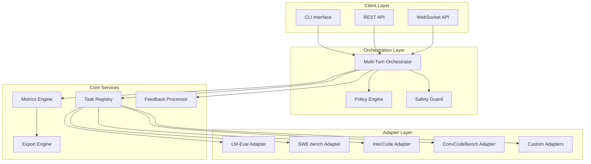

# Multi-Turn Evaluation Engine Documentation

Welcome to the comprehensive documentation for the Multi-Turn Evaluation Engine. This documentation provides everything you need to understand, deploy, use, and extend the evaluation system.

## 📚 Documentation Overview

### Quick Start
- **[Installation Guide](installation_guide.md)** - Get up and running quickly
- **[Quick Start Tutorial](quick_start_tutorial.md)** - Your first multi-turn evaluation
- **[Configuration Guide](configuration_guide.md)** - Basic configuration setup

### API Documentation
- **[API Specification](api_specification.yaml)** - Complete OpenAPI/Swagger specification
- **[REST API Guide](rest_api_guide.md)** - Detailed API usage examples
- **[WebSocket Guide](websocket_guide.md)** - Real-time communication documentation
- **[Authentication Guide](authentication_guide.md)** - Security and access control

### Developer Resources
- **[Developer Guide](developer_guide.md)** - Extending and customizing the system
- **[Interface Definitions](interface_definitions.md)** - Complete interface specifications
- **[Architecture Overview](architecture_overview.md)** - System design and components
- **[Contributing Guide](contributing_guide.md)** - How to contribute to the project

### User Guides
- **[CLI Reference](cli_reference.md)** - Command-line interface documentation
- **[Configuration Reference](configuration_reference.md)** - Complete configuration options
- **[Metrics Guide](metrics_guide.md)** - Understanding evaluation metrics
- **[Safety Guide](safety_guide.md)** - Security and safety features

### Troubleshooting & Support
- **[Troubleshooting Guide](troubleshooting_guide.md)** - Common issues and solutions
- **[FAQ](faq.md)** - Frequently asked questions
- **[Performance Tuning](performance_tuning.md)** - Optimization guidelines
- **[Monitoring Guide](monitoring_guide.md)** - System monitoring and observability

## 🚀 Getting Started

### Prerequisites
- Python 3.8 or higher
- 4GB RAM minimum (8GB recommended)
- Network connectivity for external benchmark adapters

### Quick Installation
```bash
# Clone the repository
git clone https://github.com/your-org/multi-turn-evaluation-engine.git
cd multi-turn-evaluation-engine

# Install dependencies
pip install -r requirements.txt

# Install the package
pip install -e .

# Verify installation
multi-turn --version
```

### Your First Evaluation
```bash
# Create a basic configuration
multi-turn init-config --output config.yaml --template basic

# Edit the configuration with your model and tasks
# Then run the evaluation
multi-turn run-config config.yaml --interactive
```

## 🏗️ Architecture Overview

The Multi-Turn Evaluation Engine is built with a modular, extensible architecture:



## 📋 Key Features

### Multi-Turn Evaluation Support
- **Conversational AI Evaluation**: Multi-turn dialogue and reasoning tasks
- **Code Generation & Debugging**: Interactive programming scenarios
- **Problem Solving**: Complex, multi-step problem resolution
- **Tool Usage**: Evaluation of AI agents using external tools

### Comprehensive Benchmark Integration
- **SWE-bench**: Software engineering benchmarks
- **InterCode**: Interactive coding environments
- **ConvCodeBench**: Conversational code generation
- **BugsInPy & Defects4J**: Bug fixing benchmarks
- **Custom Benchmarks**: Easy integration of new evaluation scenarios

### Advanced Metrics & Analysis
- **Task Success Metrics**: Resolution rate, recall, MRR
- **Efficiency Metrics**: Turn count, redundancy analysis
- **Quality Metrics**: Code quality, solution elegance
- **Cost Metrics**: Token usage, API costs, execution time
- **Safety Metrics**: Violation tracking, incident analysis

### Safety & Security
- **Multi-layered Safety**: Tool whitelisting, command filtering
- **Resource Monitoring**: CPU, memory, disk usage limits
- **Execution Sandboxing**: Isolated execution environments
- **Incident Tracking**: Comprehensive safety logging
- **Policy Enforcement**: Configurable safety policies

### Developer-Friendly APIs
- **REST API**: Complete programmatic access
- **WebSocket API**: Real-time progress monitoring
- **CLI Tools**: Command-line interface for automation
- **Python SDK**: Native Python integration
- **OpenAPI Specification**: Auto-generated client libraries

## 📊 Supported Evaluation Scenarios

### 1. Repository Bug Fixing (SWE-bench)
Evaluate AI agents on real-world software engineering tasks:
- Clone repositories and checkout specific commits
- Analyze bug reports and failing tests
- Generate and apply code fixes
- Validate solutions against test suites

### 2. Interactive Code Debugging (InterCode)
Multi-turn coding scenarios with immediate feedback:
- Python, Bash, and SQL environments
- Interactive execution with stdout/stderr capture
- State persistence across turns
- Tool usage tracking and analysis

### 3. Conversational Code Generation (ConvCodeBench)
Dialogue-based programming assistance:
- Multi-turn code generation conversations
- Context-aware code suggestions
- Iterative refinement and debugging
- Natural language to code translation

### 4. Cross-Language Bug Fixing (BugsInPy, Defects4J)
Language-specific debugging challenges:
- Python bug fixing with BugsInPy
- Java defect resolution with Defects4J
- Cross-language pattern analysis
- Language-specific tool integration

### 5. Custom Evaluation Scenarios
Flexible framework for custom evaluations:
- Define custom environments and tasks
- Implement domain-specific metrics
- Create specialized safety policies
- Integrate with proprietary benchmarks

### 6. Requirement Clarification
Interactive requirement gathering and clarification:
- Ambiguous specification resolution
- Stakeholder interaction simulation
- Iterative requirement refinement
- Documentation generation

## 🔧 Configuration Examples

### Basic Multi-Turn Evaluation
```yaml
# config.yaml
model_id: "gpt-4"
task_ids:
  - "swe_bench_lite_python_001"
  - "intercode_python_basic_001"

max_turns: 10
timeout_seconds: 3600

feedback_strategy: "adaptive"
safety_level: "moderate"

feedback_config:
  context_strategy: "adaptive"
  max_feedback_length: 10000
  enable_stack_summarization: true

safety_config:
  allowed_tools: ["python", "bash", "git"]
  enable_sandboxing: true
  max_execution_time: 300
```

### Advanced Configuration with Custom Metrics
```yaml
# advanced_config.yaml
model_id: "claude-3-sonnet"
task_ids:
  - "convcode_bench_debugging_001"
  - "bugs_in_py_complex_001"

max_turns: 15
timeout_seconds: 7200

feedback_strategy: "full"
safety_level: "strict"

custom_metrics:
  - name: "code_quality"
    calculator: "custom_code_quality"
    weight: 0.3
  - name: "debugging_efficiency"
    calculator: "custom_debugging"
    weight: 0.4

export_config:
  formats: ["json", "csv", "pdf"]
  include_turn_details: true
  generate_summary_report: true

metadata:
  experiment_name: "advanced_debugging_study"
  researcher: "research_team@company.com"
  version: "v2.1"
```

## 📈 Metrics and Analysis

The system provides comprehensive metrics across multiple dimensions:

### Task Success Metrics
- **Resolved%**: Percentage of tasks completed successfully
- **Recall**: Ability to identify and fix all issues
- **MRR (Mean Reciprocal Rank)**: Quality of solution ranking

### Efficiency Metrics
- **Average Turns**: Mean number of turns per task
- **Average Steps**: Mean number of actions per task
- **Redundancy Rate**: Percentage of redundant actions

### Quality Metrics
- **Edit Churn**: Amount of code modification
- **Files Touched**: Number of files modified
- **Solution Elegance**: Simplicity and effectiveness score

### Cost Metrics
- **Wall Time per Solved**: Average time per successful task
- **Tokens per Solved**: Average token usage per success
- **Cost per Solved**: Average monetary cost per success

### Safety Metrics
- **Safety Incidents**: Number of safety violations
- **Policy Violations**: Specific policy breach counts
- **Risk Assessment**: Overall risk level analysis

## 🔒 Security and Safety

### Multi-Layered Safety System
1. **Input Validation**: Sanitize all inputs and commands
2. **Tool Whitelisting**: Only allow approved tools and commands
3. **Resource Monitoring**: Track CPU, memory, and disk usage
4. **Execution Sandboxing**: Isolate evaluation environments
5. **Output Filtering**: Screen outputs for sensitive information

### Configurable Safety Policies
```yaml
safety_config:
  # Tool restrictions
  allowed_tools: ["python", "bash", "git", "curl"]
  blocked_commands: ["rm -rf", "del /f /q", "format", "fdisk"]
  
  # Resource limits
  resource_limits:
    memory: "2GB"
    cpu_time: "300s"
    disk_space: "1GB"
    network_requests: 100
  
  # Execution controls
  enable_sandboxing: true
  sandbox_type: "docker"
  timeout_per_action: 60
  
  # Monitoring
  log_all_actions: true
  alert_on_violations: true
  auto_terminate_on_critical: true
```

## 🚀 Deployment Options

### Local Development
```bash
# Run locally with development server
multi-turn serve --host localhost --port 8000 --reload
```

### Docker Deployment
```bash
# Build and run with Docker
docker build -t evaluation-engine .
docker run -p 8000:8000 -v $(pwd)/config:/app/config evaluation-engine
```

### Kubernetes Deployment
```yaml
# kubernetes/deployment.yaml
apiVersion: apps/v1
kind: Deployment
metadata:
  name: evaluation-engine
spec:
  replicas: 3
  selector:
    matchLabels:
      app: evaluation-engine
  template:
    metadata:
      labels:
        app: evaluation-engine
    spec:
      containers:
      - name: evaluation-engine
        image: evaluation-engine:latest
        ports:
        - containerPort: 8000
        env:
        - name: DATABASE_URL
          valueFrom:
            secretKeyRef:
              name: db-secret
              key: url
```

### Cloud Deployment
- **AWS**: ECS, EKS, or Lambda deployment options
- **Google Cloud**: GKE, Cloud Run, or App Engine
- **Azure**: AKS, Container Instances, or App Service
- **Serverless**: Function-based deployment for specific scenarios

## 📞 Support and Community

### Getting Help
- **Documentation**: Comprehensive guides and references
- **GitHub Issues**: Bug reports and feature requests
- **Community Forum**: Discussion and Q&A
- **Stack Overflow**: Tag questions with `multi-turn-evaluation`

### Contributing
We welcome contributions! See our [Contributing Guide](contributing_guide.md) for:
- Code contribution guidelines
- Development setup instructions
- Testing requirements
- Documentation standards

### Enterprise Support
For enterprise deployments and custom integrations:
- **Professional Services**: Custom adapter development
- **Training**: Team training and best practices
- **Support**: Priority support and SLA options
- **Consulting**: Architecture and deployment guidance

## 📄 License

This project is licensed under the MIT License - see the [LICENSE](../LICENSE.md) file for details.

## 🙏 Acknowledgments

- OpenAI for the Gym environment interface inspiration
- The lm-evaluation-harness project for single-turn evaluation patterns
- SWE-bench, InterCode, and other benchmark creators
- The open-source community for tools and libraries

---

**Ready to get started?** Check out our [Quick Start Tutorial](quick_start_tutorial.md) or dive into the [API Documentation](api_specification.yaml).

For the latest updates and announcements, follow our [GitHub repository](https://github.com/your-org/multi-turn-evaluation-engine) and join our community discussions.