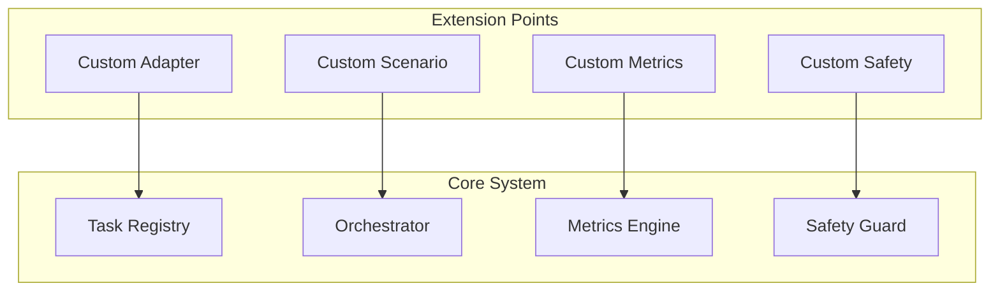

# Multi-Turn Evaluation Engine Developer Guide

## Table of Contents

1. [Overview](#overview)
2. [Architecture](#architecture)
3. [Creating Custom Adapters](#creating-custom-adapters)
4. [Implementing Custom Scenarios](#implementing-custom-scenarios)
5. [Extending the Task Registry](#extending-the-task-registry)
6. [Custom Metrics Implementation](#custom-metrics-implementation)
7. [Safety Guard Extensions](#safety-guard-extensions)
8. [Testing Guidelines](#testing-guidelines)
9. [API Integration](#api-integration)
10. [Best Practices](#best-practices)

## Overview

The Multi-Turn Evaluation Engine is designed with extensibility in mind. This guide provides comprehensive information for developers who want to:

- Create custom benchmark adapters
- Implement new evaluation scenarios
- Extend the metrics system
- Add custom safety controls
- Integrate with external systems

## Architecture

### Core Components



### Key Interfaces

All extensions must implement specific interfaces to ensure compatibility:

- `BenchmarkAdapter`: For external benchmark integration
- `UnifiedEnv`: For custom evaluation environments
- `MetricsCalculator`: For custom metrics
- `SafetyPolicy`: For custom safety rules

## Creating Custom Adapters

### Step 1: Implement the BenchmarkAdapter Interface

```python
from abc import ABC, abstractmethod
from typing import Dict, List, Any, Optional
from ..core.adapters import BenchmarkAdapter
from ..core.data_models import Task, StandardizedResult
from ..core.scenario_environments import UnifiedEnv

class MyCustomAdapter(BenchmarkAdapter):
    """
    Custom adapter for integrating with MyBenchmark.
    
    This example shows how to create an adapter for a hypothetical
    benchmark tool called "MyBenchmark".
    """
    
    def __init__(self, config: Dict[str, Any]):
        """
        Initialize the adapter with configuration.
        
        Args:
            config: Adapter-specific configuration
        """
        super().__init__()
        self.config = config
        self.benchmark_client = None
        self._initialize_client()
    
    def _initialize_client(self):
        """Initialize connection to the benchmark system."""
        # Initialize your benchmark client here
        # Example: self.benchmark_client = MyBenchmarkClient(self.config)
        pass
    
    @abstractmethod
    def create_environment(self, task_config: Dict[str, Any]) -> UnifiedEnv:
        """
        Create environment instance for the benchmark.
        
        Args:
            task_config: Task-specific configuration
            
        Returns:
            UnifiedEnv instance for the task
        """
        return MyCustomEnvironment(task_config, self.benchmark_client)
    
    @abstractmethod
    def load_tasks(self, task_filter: Optional[Dict[str, Any]] = None) -> List[Task]:
        """
        Load available tasks from the benchmark.
        
        Args:
            task_filter: Optional filter criteria
            
        Returns:
            List of available tasks
        """
        # Load tasks from your benchmark
        raw_tasks = self.benchmark_client.get_tasks(task_filter)
        
        tasks = []
        for raw_task in raw_tasks:
            task = Task(
                task_id=raw_task['id'],
                name=raw_task['name'],
                description=raw_task['description'],
                task_type='multi_turn',  # or 'single_turn'
                category=raw_task.get('category', 'general'),
                difficulty=raw_task.get('difficulty', 'medium'),
                requirements=raw_task.get('requirements', []),
                metadata=raw_task.get('metadata', {})
            )
            tasks.append(task)
        
        return tasks
    
    @abstractmethod
    def convert_results(self, results: Any) -> StandardizedResult:
        """
        Convert benchmark-specific results to standardized format.
        
        Args:
            results: Raw results from the benchmark
            
        Returns:
            Standardized result object
        """
        return StandardizedResult(
            task_id=results['task_id'],
            success=results['success'],
            score=results.get('score', 0.0),
            metrics=results.get('metrics', {}),
            execution_time=results.get('execution_time', 0.0),
            metadata=results.get('metadata', {})
        )
    
    def validate_task_config(self, task_config: Dict[str, Any]) -> bool:
        """
        Validate task configuration for this adapter.
        
        Args:
            task_config: Task configuration to validate
            
        Returns:
            True if valid, False otherwise
        """
        required_fields = ['task_id', 'benchmark_specific_field']
        return all(field in task_config for field in required_fields)
    
    def get_adapter_info(self) -> Dict[str, Any]:
        """
        Get information about this adapter.
        
        Returns:
            Adapter information dictionary
        """
        return {
            'name': 'MyCustomAdapter',
            'version': '1.0.0',
            'description': 'Adapter for MyBenchmark integration',
            'supported_task_types': ['multi_turn'],
            'required_config': ['api_key', 'endpoint_url'],
            'optional_config': ['timeout', 'retry_count']
        }
```

### Step 2: Implement the UnifiedEnv Interface

```python
from typing import Tuple, Dict, Any
from ..core.scenario_environments import UnifiedEnv

class MyCustomEnvironment(UnifiedEnv):
    """
    Custom environment for MyBenchmark tasks.
    """
    
    def __init__(self, task_config: Dict[str, Any], benchmark_client):
        """
        Initialize the environment.
        
        Args:
            task_config: Task-specific configuration
            benchmark_client: Client for benchmark communication
        """
        super().__init__(task_config)
        self.benchmark_client = benchmark_client
        self.task_id = task_config['task_id']
        self.current_state = None
        self.turn_count = 0
        self.max_turns = task_config.get('max_turns', 10)
        self.is_done = False
        self.success_achieved = False
    
    def reset(self) -> Dict[str, Any]:
        """
        Reset environment to initial state.
        
        Returns:
            Initial observation
        """
        # Reset the benchmark environment
        self.current_state = self.benchmark_client.reset_task(self.task_id)
        self.turn_count = 0
        self.is_done = False
        self.success_achieved = False
        
        # Return initial observation
        return {
            'task_description': self.current_state['description'],
            'initial_context': self.current_state['context'],
            'available_actions': self.current_state['actions'],
            'turn': self.turn_count
        }
    
    def step(self, action: Dict[str, Any]) -> Tuple[Dict[str, Any], float, bool, Dict[str, Any]]:
        """
        Execute action and return (observation, reward, done, info).
        
        Args:
            action: Action to execute
            
        Returns:
            Tuple of (observation, reward, done, info)
        """
        if self.is_done:
            raise ValueError("Environment is already done. Call reset() first.")
        
        self.turn_count += 1
        
        # Execute action in benchmark
        result = self.benchmark_client.execute_action(
            self.task_id, 
            action, 
            self.current_state
        )
        
        # Update state
        self.current_state = result['new_state']
        
        # Calculate reward
        reward = self._calculate_reward(result)
        
        # Check if done
        self.is_done = (
            result['task_completed'] or 
            self.turn_count >= self.max_turns or
            result.get('error', False)
        )
        
        self.success_achieved = result.get('success', False)
        
        # Create observation
        observation = {
            'output': result.get('output', ''),
            'state': self.current_state,
            'available_actions': result.get('available_actions', []),
            'turn': self.turn_count
        }
        
        # Create info
        info = {
            'turn_count': self.turn_count,
            'max_turns': self.max_turns,
            'execution_time': result.get('execution_time', 0.0),
            'tokens_used': result.get('tokens_used', 0),
            'cost': result.get('cost', 0.0),
            'error': result.get('error'),
            'benchmark_specific_info': result.get('metadata', {})
        }
        
        return observation, reward, self.is_done, info
    
    def success(self) -> bool:
        """
        Check if task has been completed successfully.
        
        Returns:
            True if task completed successfully
        """
        return self.success_achieved
    
    def info(self) -> Dict[str, Any]:
        """
        Get current environment information and metadata.
        
        Returns:
            Environment information dictionary
        """
        return {
            'task_id': self.task_id,
            'turn_count': self.turn_count,
            'max_turns': self.max_turns,
            'is_done': self.is_done,
            'success': self.success_achieved,
            'current_state': self.current_state
        }
    
    def get_metrics(self) -> Dict[str, float]:
        """
        Get current performance metrics.
        
        Returns:
            Dictionary of metrics
        """
        return {
            'turns_used': float(self.turn_count),
            'turns_remaining': float(self.max_turns - self.turn_count),
            'progress': float(self.turn_count) / float(self.max_turns),
            'success_rate': 1.0 if self.success_achieved else 0.0
        }
    
    def _calculate_reward(self, result: Dict[str, Any]) -> float:
        """
        Calculate reward for the current step.
        
        Args:
            result: Result from benchmark execution
            
        Returns:
            Reward value
        """
        # Implement your reward calculation logic
        base_reward = 0.0
        
        if result.get('success', False):
            base_reward += 10.0  # Success bonus
        
        if result.get('progress', 0) > 0:
            base_reward += result['progress'] * 2.0  # Progress reward
        
        if result.get('error', False):
            base_reward -= 5.0  # Error penalty
        
        # Efficiency bonus (fewer turns is better)
        efficiency_bonus = (self.max_turns - self.turn_count) / self.max_turns
        base_reward += efficiency_bonus
        
        return base_reward
```

### Step 3: Register Your Adapter

```python
from ..core.unified_task_registry import UnifiedTaskRegistry

def register_custom_adapter():
    """Register the custom adapter with the task registry."""
    registry = UnifiedTaskRegistry()
    
    # Create adapter configuration
    adapter_config = {
        'api_key': 'your_api_key',
        'endpoint_url': 'https://api.mybenchmark.com',
        'timeout': 300,
        'retry_count': 3
    }
    
    # Create and register adapter
    adapter = MyCustomAdapter(adapter_config)
    registry.register_adapter('my_benchmark', adapter)
    
    print("Custom adapter registered successfully!")

# Call during initialization
register_custom_adapter()
```

## Implementing Custom Scenarios

### Creating a New Scenario Environment

```python
from ..core.scenario_environments import UnifiedEnv

class CustomDebuggingScenario(UnifiedEnv):
    """
    Custom scenario for advanced debugging tasks.
    """
    
    def __init__(self, task_config: Dict[str, Any]):
        super().__init__(task_config)
        self.code_base = task_config['code_base']
        self.bug_description = task_config['bug_description']
        self.test_cases = task_config['test_cases']
        self.current_files = {}
        self.modifications = []
        self.test_results = {}
    
    def reset(self) -> Dict[str, Any]:
        """Reset to initial debugging state."""
        # Load initial code base
        self.current_files = self._load_code_base(self.code_base)
        self.modifications = []
        self.test_results = {}
        
        return {
            'bug_description': self.bug_description,
            'available_files': list(self.current_files.keys()),
            'test_cases': self.test_cases,
            'initial_test_results': self._run_tests()
        }
    
    def step(self, action: Dict[str, Any]) -> Tuple[Dict[str, Any], float, bool, Dict[str, Any]]:
        """Execute debugging action."""
        action_type = action['type']
        
        if action_type == 'read_file':
            return self._handle_read_file(action)
        elif action_type == 'modify_file':
            return self._handle_modify_file(action)
        elif action_type == 'run_tests':
            return self._handle_run_tests(action)
        elif action_type == 'add_debug_print':
            return self._handle_add_debug_print(action)
        else:
            raise ValueError(f"Unknown action type: {action_type}")
    
    def _handle_read_file(self, action: Dict[str, Any]) -> Tuple[Dict[str, Any], float, bool, Dict[str, Any]]:
        """Handle file reading action."""
        filename = action['filename']
        
        if filename not in self.current_files:
            observation = {'error': f'File not found: {filename}'}
            return observation, -1.0, False, {'action': 'read_file', 'success': False}
        
        observation = {
            'filename': filename,
            'content': self.current_files[filename],
            'line_count': len(self.current_files[filename].split('\n'))
        }
        
        return observation, 0.1, False, {'action': 'read_file', 'success': True}
    
    def _handle_modify_file(self, action: Dict[str, Any]) -> Tuple[Dict[str, Any], float, bool, Dict[str, Any]]:
        """Handle file modification action."""
        filename = action['filename']
        new_content = action['content']
        
        if filename not in self.current_files:
            observation = {'error': f'File not found: {filename}'}
            return observation, -2.0, False, {'action': 'modify_file', 'success': False}
        
        # Store modification
        old_content = self.current_files[filename]
        self.current_files[filename] = new_content
        self.modifications.append({
            'filename': filename,
            'old_content': old_content,
            'new_content': new_content,
            'timestamp': datetime.utcnow()
        })
        
        observation = {
            'filename': filename,
            'modification_applied': True,
            'lines_changed': self._count_changed_lines(old_content, new_content)
        }
        
        return observation, 0.5, False, {'action': 'modify_file', 'success': True}
    
    def _handle_run_tests(self, action: Dict[str, Any]) -> Tuple[Dict[str, Any], float, bool, Dict[str, Any]]:
        """Handle test execution action."""
        test_results = self._run_tests()
        self.test_results = test_results
        
        # Check if all tests pass
        all_passed = all(result['passed'] for result in test_results.values())
        
        observation = {
            'test_results': test_results,
            'all_tests_passed': all_passed,
            'passed_count': sum(1 for r in test_results.values() if r['passed']),
            'total_count': len(test_results)
        }
        
        # Calculate reward based on test results
        reward = 5.0 if all_passed else sum(2.0 for r in test_results.values() if r['passed'])
        
        # Task is done if all tests pass
        done = all_passed
        
        return observation, reward, done, {'action': 'run_tests', 'success': True}
```

## Custom Metrics Implementation

### Creating Custom Metrics Calculator

```python
from typing import Dict, List, Any
from ..core.metrics_engine import MetricsCalculator
from ..core.data_models import TurnResult, EvaluationResult

class CustomMetricsCalculator(MetricsCalculator):
    """
    Custom metrics calculator for specialized evaluation scenarios.
    """
    
    def calculate_task_metrics(self, turn_results: List[TurnResult]) -> Dict[str, float]:
        """
        Calculate custom task-level metrics.
        
        Args:
            turn_results: List of turn results for the task
            
        Returns:
            Dictionary of calculated metrics
        """
        metrics = {}
        
        # Custom metric: Code Quality Score
        metrics['code_quality_score'] = self._calculate_code_quality(turn_results)
        
        # Custom metric: Debugging Efficiency
        metrics['debugging_efficiency'] = self._calculate_debugging_efficiency(turn_results)
        
        # Custom metric: Test Coverage Improvement
        metrics['test_coverage_improvement'] = self._calculate_coverage_improvement(turn_results)
        
        # Custom metric: Solution Elegance
        metrics['solution_elegance'] = self._calculate_solution_elegance(turn_results)
        
        return metrics
    
    def _calculate_code_quality(self, turn_results: List[TurnResult]) -> float:
        """Calculate code quality score based on modifications."""
        if not turn_results:
            return 0.0
        
        quality_score = 0.0
        modification_count = 0
        
        for turn in turn_results:
            if 'code_modifications' in turn.info:
                modifications = turn.info['code_modifications']
                for mod in modifications:
                    # Analyze code quality factors
                    quality_factors = {
                        'readability': self._assess_readability(mod['new_content']),
                        'complexity': self._assess_complexity(mod['new_content']),
                        'maintainability': self._assess_maintainability(mod['new_content'])
                    }
                    
                    mod_quality = sum(quality_factors.values()) / len(quality_factors)
                    quality_score += mod_quality
                    modification_count += 1
        
        return quality_score / modification_count if modification_count > 0 else 0.0
    
    def _calculate_debugging_efficiency(self, turn_results: List[TurnResult]) -> float:
        """Calculate debugging efficiency based on problem-solving approach."""
        if not turn_results:
            return 0.0
        
        # Factors that contribute to debugging efficiency
        systematic_approach = 0.0
        hypothesis_testing = 0.0
        tool_usage = 0.0
        
        for turn in turn_results:
            action = turn.action
            
            # Reward systematic debugging approaches
            if action.get('type') == 'analyze_error':
                systematic_approach += 1.0
            elif action.get('type') == 'add_debug_print':
                hypothesis_testing += 0.8
            elif action.get('type') == 'run_specific_test':
                hypothesis_testing += 1.0
            elif action.get('type') == 'use_debugger':
                tool_usage += 1.2
        
        total_turns = len(turn_results)
        efficiency = (systematic_approach + hypothesis_testing + tool_usage) / total_turns
        
        return min(efficiency, 1.0)  # Cap at 1.0
    
    def _calculate_coverage_improvement(self, turn_results: List[TurnResult]) -> float:
        """Calculate test coverage improvement."""
        initial_coverage = 0.0
        final_coverage = 0.0
        
        for turn in turn_results:
            if 'test_coverage' in turn.info:
                if initial_coverage == 0.0:
                    initial_coverage = turn.info['test_coverage']
                final_coverage = turn.info['test_coverage']
        
        return max(0.0, final_coverage - initial_coverage)
    
    def _calculate_solution_elegance(self, turn_results: List[TurnResult]) -> float:
        """Calculate solution elegance based on simplicity and effectiveness."""
        if not turn_results:
            return 0.0
        
        # Factors for elegance
        lines_changed = 0
        files_modified = set()
        complexity_added = 0.0
        
        for turn in turn_results:
            if 'code_modifications' in turn.info:
                for mod in turn.info['code_modifications']:
                    lines_changed += mod.get('lines_changed', 0)
                    files_modified.add(mod['filename'])
                    complexity_added += mod.get('complexity_delta', 0)
        
        # Elegance is inversely related to changes and complexity
        elegance = 1.0 / (1.0 + 0.1 * lines_changed + 0.2 * len(files_modified) + 0.3 * complexity_added)
        
        return elegance
```

### Registering Custom Metrics

```python
from ..core.metrics_engine import MetricsEngine

def register_custom_metrics():
    """Register custom metrics calculator."""
    metrics_engine = MetricsEngine()
    custom_calculator = CustomMetricsCalculator()
    
    metrics_engine.register_calculator('custom_debugging', custom_calculator)
    print("Custom metrics calculator registered!")

# Call during initialization
register_custom_metrics()
```

## Safety Guard Extensions

### Creating Custom Safety Policies

```python
from typing import Dict, Any, List, Tuple
from ..core.safety_guard import SafetyPolicy
from ..core.data_models import Action

class CustomSafetyPolicy(SafetyPolicy):
    """
    Custom safety policy for specialized evaluation scenarios.
    """
    
    def __init__(self, config: Dict[str, Any]):
        super().__init__(config)
        self.restricted_operations = config.get('restricted_operations', [])
        self.max_file_size = config.get('max_file_size', 1024 * 1024)  # 1MB
        self.allowed_domains = config.get('allowed_domains', [])
    
    def validate_action(self, action: Action, context: Dict[str, Any]) -> Tuple[bool, str]:
        """
        Validate action against custom safety rules.
        
        Args:
            action: Action to validate
            context: Current execution context
            
        Returns:
            Tuple of (is_valid, reason)
        """
        # Check for restricted operations
        if action.get('type') in self.restricted_operations:
            return False, f"Operation '{action['type']}' is restricted"
        
        # Check file size limits
        if action.get('type') == 'write_file':
            content = action.get('content', '')
            if len(content.encode('utf-8')) > self.max_file_size:
                return False, f"File size exceeds limit of {self.max_file_size} bytes"
        
        # Check network access
        if action.get('type') == 'http_request':
            url = action.get('url', '')
            domain = self._extract_domain(url)
            if domain not in self.allowed_domains:
                return False, f"Access to domain '{domain}' is not allowed"
        
        # Check for potential code injection
        if self._contains_suspicious_code(action):
            return False, "Potentially malicious code detected"
        
        return True, "Action is safe"
    
    def _extract_domain(self, url: str) -> str:
        """Extract domain from URL."""
        from urllib.parse import urlparse
        return urlparse(url).netloc
    
    def _contains_suspicious_code(self, action: Action) -> bool:
        """Check for suspicious code patterns."""
        suspicious_patterns = [
            'eval(',
            'exec(',
            '__import__',
            'subprocess.call',
            'os.system',
            'rm -rf',
            'del /f /q'
        ]
        
        content = str(action)
        return any(pattern in content for pattern in suspicious_patterns)
```

## Testing Guidelines

### Unit Testing Custom Components

```python
import unittest
from unittest.mock import Mock, patch
from ..adapters.my_custom_adapter import MyCustomAdapter
from ..environments.my_custom_environment import MyCustomEnvironment

class TestMyCustomAdapter(unittest.TestCase):
    """Test cases for custom adapter."""
    
    def setUp(self):
        """Set up test fixtures."""
        self.config = {
            'api_key': 'test_key',
            'endpoint_url': 'https://test.api.com',
            'timeout': 30
        }
        self.adapter = MyCustomAdapter(self.config)
    
    def test_adapter_initialization(self):
        """Test adapter initialization."""
        self.assertIsNotNone(self.adapter)
        self.assertEqual(self.adapter.config, self.config)
    
    @patch('my_benchmark_client.MyBenchmarkClient')
    def test_load_tasks(self, mock_client):
        """Test task loading."""
        # Mock benchmark client response
        mock_client.return_value.get_tasks.return_value = [
            {
                'id': 'test_task_1',
                'name': 'Test Task 1',
                'description': 'A test task',
                'category': 'testing',
                'difficulty': 'easy'
            }
        ]
        
        tasks = self.adapter.load_tasks()
        
        self.assertEqual(len(tasks), 1)
        self.assertEqual(tasks[0].task_id, 'test_task_1')
        self.assertEqual(tasks[0].name, 'Test Task 1')
    
    def test_validate_task_config(self):
        """Test task configuration validation."""
        valid_config = {
            'task_id': 'test_task',
            'benchmark_specific_field': 'value'
        }
        invalid_config = {
            'task_id': 'test_task'
            # Missing benchmark_specific_field
        }
        
        self.assertTrue(self.adapter.validate_task_config(valid_config))
        self.assertFalse(self.adapter.validate_task_config(invalid_config))

class TestMyCustomEnvironment(unittest.TestCase):
    """Test cases for custom environment."""
    
    def setUp(self):
        """Set up test fixtures."""
        self.task_config = {
            'task_id': 'test_task',
            'max_turns': 5
        }
        self.mock_client = Mock()
        self.env = MyCustomEnvironment(self.task_config, self.mock_client)
    
    def test_environment_reset(self):
        """Test environment reset."""
        self.mock_client.reset_task.return_value = {
            'description': 'Test task description',
            'context': 'Initial context',
            'actions': ['action1', 'action2']
        }
        
        observation = self.env.reset()
        
        self.assertIn('task_description', observation)
        self.assertIn('initial_context', observation)
        self.assertEqual(observation['turn'], 0)
    
    def test_environment_step(self):
        """Test environment step execution."""
        # Setup initial state
        self.env.reset()
        
        # Mock action execution
        self.mock_client.execute_action.return_value = {
            'new_state': {'updated': True},
            'output': 'Action executed',
            'task_completed': False,
            'success': False,
            'execution_time': 1.5,
            'tokens_used': 100,
            'cost': 0.01
        }
        
        action = {'type': 'test_action', 'params': {}}
        observation, reward, done, info = self.env.step(action)
        
        self.assertIn('output', observation)
        self.assertIsInstance(reward, float)
        self.assertIsInstance(done, bool)
        self.assertIn('turn_count', info)

if __name__ == '__main__':
    unittest.main()
```

### Integration Testing

```python
import asyncio
import unittest
from ..core.orchestrator import MultiTurnOrchestrator
from ..adapters.my_custom_adapter import MyCustomAdapter

class TestCustomAdapterIntegration(unittest.TestCase):
    """Integration tests for custom adapter."""
    
    def setUp(self):
        """Set up integration test environment."""
        self.adapter_config = {
            'api_key': 'test_key',
            'endpoint_url': 'https://test.api.com'
        }
        self.adapter = MyCustomAdapter(self.adapter_config)
        
        # Set up orchestrator with custom adapter
        from ..core.policy_engine import PolicyEngine
        from ..core.feedback_processor import FeedbackProcessor
        from ..core.safety_guard import SafetyGuard
        from ..core.metrics_engine import MetricsEngine
        
        self.orchestrator = MultiTurnOrchestrator(
            policy_engine=PolicyEngine(),
            feedback_processor=FeedbackProcessor(),
            safety_guard=SafetyGuard(),
            metrics_engine=MetricsEngine()
        )
    
    def test_end_to_end_evaluation(self):
        """Test complete evaluation workflow."""
        # This would test the full evaluation pipeline
        # with your custom adapter
        pass
```

## API Integration

### Creating Custom API Endpoints

```python
from fastapi import APIRouter, Depends, HTTPException
from typing import Dict, Any
from ..api.models import CustomEvaluationRequest, CustomEvaluationResponse

router = APIRouter(prefix="/custom", tags=["Custom Evaluation"])

@router.post("/my-benchmark/evaluate", response_model=CustomEvaluationResponse)
async def evaluate_with_custom_benchmark(
    request: CustomEvaluationRequest,
    current_user: dict = Depends(get_current_user)
):
    """
    Custom endpoint for MyBenchmark evaluations.
    """
    try:
        # Initialize custom adapter
        adapter = MyCustomAdapter(request.adapter_config)
        
        # Create evaluation configuration
        config = create_custom_config(request)
        
        # Execute evaluation
        results = await execute_custom_evaluation(
            adapter, request.model_id, request.task_ids, config
        )
        
        return CustomEvaluationResponse(
            evaluation_id=results['evaluation_id'],
            status="completed",
            results=results['data']
        )
        
    except Exception as e:
        raise HTTPException(status_code=500, detail=str(e))
```

## Best Practices

### 1. Error Handling

```python
class CustomAdapterError(Exception):
    """Custom exception for adapter-specific errors."""
    pass

def safe_benchmark_call(func, *args, **kwargs):
    """Wrapper for safe benchmark API calls."""
    try:
        return func(*args, **kwargs)
    except ConnectionError as e:
        raise CustomAdapterError(f"Connection failed: {str(e)}")
    except TimeoutError as e:
        raise CustomAdapterError(f"Request timed out: {str(e)}")
    except Exception as e:
        raise CustomAdapterError(f"Unexpected error: {str(e)}")
```

### 2. Configuration Management

```python
from pydantic import BaseModel, Field
from typing import Optional

class CustomAdapterConfig(BaseModel):
    """Configuration model for custom adapter."""
    
    api_key: str = Field(..., description="API key for benchmark access")
    endpoint_url: str = Field(..., description="Benchmark API endpoint")
    timeout: int = Field(300, description="Request timeout in seconds")
    retry_count: int = Field(3, description="Number of retry attempts")
    batch_size: Optional[int] = Field(None, description="Batch size for bulk operations")
    
    class Config:
        extra = "forbid"  # Prevent additional fields
```

### 3. Logging and Monitoring

```python
import logging
from typing import Any

logger = logging.getLogger(__name__)

class CustomAdapter(BenchmarkAdapter):
    """Custom adapter with comprehensive logging."""
    
    def create_environment(self, task_config: Dict[str, Any]) -> UnifiedEnv:
        """Create environment with logging."""
        logger.info(f"Creating environment for task: {task_config.get('task_id')}")
        
        try:
            env = MyCustomEnvironment(task_config, self.benchmark_client)
            logger.info(f"Environment created successfully")
            return env
        except Exception as e:
            logger.error(f"Failed to create environment: {str(e)}")
            raise
    
    def load_tasks(self, task_filter: Optional[Dict[str, Any]] = None) -> List[Task]:
        """Load tasks with logging."""
        logger.info(f"Loading tasks with filter: {task_filter}")
        
        try:
            tasks = self._fetch_tasks_from_benchmark(task_filter)
            logger.info(f"Loaded {len(tasks)} tasks successfully")
            return tasks
        except Exception as e:
            logger.error(f"Failed to load tasks: {str(e)}")
            raise
```

### 4. Performance Optimization

```python
import asyncio
from concurrent.futures import ThreadPoolExecutor
from typing import List

class OptimizedCustomAdapter(BenchmarkAdapter):
    """Performance-optimized custom adapter."""
    
    def __init__(self, config: Dict[str, Any]):
        super().__init__(config)
        self.executor = ThreadPoolExecutor(max_workers=config.get('max_workers', 4))
        self.cache = {}
        self.cache_ttl = config.get('cache_ttl', 300)  # 5 minutes
    
    async def load_tasks_async(self, task_filter: Optional[Dict[str, Any]] = None) -> List[Task]:
        """Asynchronously load tasks for better performance."""
        cache_key = str(task_filter)
        
        # Check cache first
        if cache_key in self.cache:
            cached_data, timestamp = self.cache[cache_key]
            if time.time() - timestamp < self.cache_ttl:
                return cached_data
        
        # Load tasks asynchronously
        loop = asyncio.get_event_loop()
        tasks = await loop.run_in_executor(
            self.executor, 
            self._fetch_tasks_from_benchmark, 
            task_filter
        )
        
        # Cache results
        self.cache[cache_key] = (tasks, time.time())
        
        return tasks
```

### 5. Documentation

Always provide comprehensive documentation for your custom components:

```python
class MyCustomAdapter(BenchmarkAdapter):
    """
    Custom adapter for MyBenchmark integration.
    
    This adapter provides integration with the MyBenchmark evaluation platform,
    supporting both single-turn and multi-turn evaluation scenarios.
    
    Features:
    - Automatic task discovery and loading
    - Real-time execution monitoring
    - Comprehensive error handling and recovery
    - Performance optimization with caching
    
    Configuration:
    - api_key (str): API key for MyBenchmark access
    - endpoint_url (str): Base URL for MyBenchmark API
    - timeout (int): Request timeout in seconds (default: 300)
    - retry_count (int): Number of retry attempts (default: 3)
    
    Example:
        ```python
        config = {
            'api_key': 'your_api_key',
            'endpoint_url': 'https://api.mybenchmark.com',
            'timeout': 600
        }
        adapter = MyCustomAdapter(config)
        registry.register_adapter('my_benchmark', adapter)
        ```
    
    Raises:
        CustomAdapterError: When benchmark communication fails
        ValidationError: When configuration is invalid
    """
```

This developer guide provides comprehensive information for extending the Multi-Turn Evaluation Engine. Follow these patterns and best practices to ensure your custom components integrate seamlessly with the existing system.