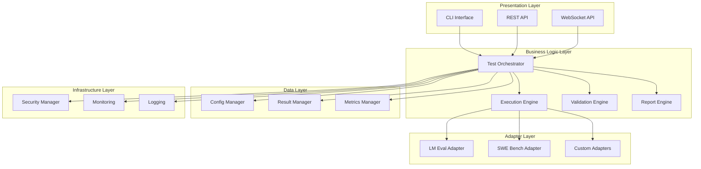

# EvaluationEngineV1_0 Testing Framework - Developer Guide

## Table of Contents

1. [Architecture Overview](#architecture-overview)
2. [Development Environment Setup](#development-environment-setup)
3. [Core Components](#core-components)
4. [Extending the Framework](#extending-the-framework)
5. [Creating Custom Adapters](#creating-custom-adapters)
6. [Adding New Task Types](#adding-new-task-types)
7. [Implementing Custom Validators](#implementing-custom-validators)
8. [API Extension](#api-extension)
9. [Testing and Quality Assurance](#testing-and-quality-assurance)
10. [Performance Optimization](#performance-optimization)
11. [Security Considerations](#security-considerations)
12. [Contributing Guidelines](#contributing-guidelines)

## Architecture Overview

### System Architecture

The EvaluationEngineV1_0 Testing Framework follows a modular architecture with clear separation of concerns:



### Design Principles

1. **Modularity**: Each component has a single responsibility
2. **Extensibility**: Easy to add new adapters, validators, and task types
3. **Testability**: All components are unit testable
4. **Configurability**: Behavior controlled through configuration
5. **Security**: Secure by default with sandboxed execution
6. **Performance**: Optimized for concurrent execution
7. **Observability**: Comprehensive logging and monitoring

### Key Patterns

- **Strategy Pattern**: For different adapter implementations
- **Factory Pattern**: For creating test components
- **Observer Pattern**: For progress monitoring
- **Command Pattern**: For test execution
- **Decorator Pattern**: For validation and security

## Development Environment Setup

### Prerequisites

```bash
# System requirements
python --version  # 3.8+
git --version
docker --version  # For SWE-bench adapter

# Development tools
pip install black flake8 mypy pytest pytest-cov
pip install pre-commit
```

### Environment Setup

```bash
# Clone repository
git clone <repository-url>
cd EvaluationEngineV1_0_tests

# Create development environment
python -m venv dev_env
source dev_env/bin/activate  # Linux/Mac
# dev_env\Scripts\activate  # Windows

# Install dependencies
pip install -r requirements.txt
pip install -r test_requirements.txt
pip install -r dev_requirements.txt

# Install pre-commit hooks
pre-commit install

# Verify setup
python -m pytest tests/unit/ -v
```

### Development Configuration

Create `dev_config.yaml`:

```yaml
# Development configuration
development:
  debug: true
  auto_reload: true
  detailed_logging: true
  
testing:
  use_mock_apis: false  # Always test with real APIs
  quick_validation: true
  save_test_artifacts: true
  
logging:
  level: DEBUG
  file: dev.log
  console: true
  
security:
  enable_sandbox: true
  strict_validation: true
```

### IDE Configuration

#### VS Code Settings

```json
{
    "python.defaultInterpreterPath": "./dev_env/bin/python",
    "python.linting.enabled": true,
    "python.linting.flake8Enabled": true,
    "python.linting.mypyEnabled": true,
    "python.formatting.provider": "black",
    "python.testing.pytestEnabled": true,
    "python.testing.pytestArgs": ["tests/"]
}
```

#### PyCharm Configuration

1. Set interpreter to `./dev_env/bin/python`
2. Enable pytest as test runner
3. Configure code style to use Black
4. Enable type checking with mypy

## Core Components

### Test Orchestrator

The central component that coordinates all testing activities:

```python
# core/test_orchestrator.py
from typing import Dict, List, Optional
from dataclasses import dataclass
from .config_manager import ConfigManager
from .execution_engine import ExecutionEngine
from .validation_engine import ValidationEngine

@dataclass
class TestResult:
    test_id: str
    status: str
    execution_time: float
    results: Dict
    validation_results: Dict
    errors: List[str]

class TestOrchestrator:
    """Central coordinator for all testing activities"""
    
    def __init__(self, config: Optional[Dict] = None):
        self.config_manager = ConfigManager(config)
        self.execution_engine = ExecutionEngine(self.config_manager)
        self.validation_engine = ValidationEngine(self.config_manager)
        self.active_tests = {}
    
    def execute_test_suite(self, suite_config: Dict) -> List[TestResult]:
        """Execute a complete test suite"""
        results = []
        
        for test_config in suite_config['tests']:
            result = self._execute_single_test(test_config)
            results.append(result)
            
            # Validate real execution
            validation_result = self.validation_engine.validate_real_execution(result)
            result.validation_results = validation_result
        
        return results
    
    def _execute_single_test(self, test_config: Dict) -> TestResult:
        """Execute a single test"""
        test_id = self._generate_test_id()
        
        try:
            # Execute test
            execution_result = self.execution_engine.execute(test_config)
            
            return TestResult(
                test_id=test_id,
                status="completed",
                execution_time=execution_result.execution_time,
                results=execution_result.results,
                validation_results={},
                errors=[]
            )
            
        except Exception as e:
            return TestResult(
                test_id=test_id,
                status="failed",
                execution_time=0,
                results={},
                validation_results={},
                errors=[str(e)]
            )
```

### Execution Engine

Handles the actual execution of tests:

```python
# core/execution_engine.py
from abc import ABC, abstractmethod
from typing import Dict, Any
from .adapters import AdapterFactory

class ExecutionResult:
    def __init__(self, results: Dict, execution_time: float, metadata: Dict):
        self.results = results
        self.execution_time = execution_time
        self.metadata = metadata

class ExecutionEngine:
    """Handles test execution through various adapters"""
    
    def __init__(self, config_manager):
        self.config_manager = config_manager
        self.adapter_factory = AdapterFactory()
    
    def execute(self, test_config: Dict) -> ExecutionResult:
        """Execute test using appropriate adapter"""
        adapter_name = test_config.get('adapter', 'lm_eval')
        adapter = self.adapter_factory.create_adapter(adapter_name)
        
        # Execute test
        start_time = time.time()
        results = adapter.execute_test(test_config)
        execution_time = time.time() - start_time
        
        # Collect metadata
        metadata = {
            'adapter': adapter_name,
            'execution_time': execution_time,
            'timestamp': datetime.utcnow().isoformat()
        }
        
        return ExecutionResult(results, execution_time, metadata)
```

### Validation Engine

Ensures tests perform real execution without mocks:

```python
# core/validation_engine.py
from typing import Dict, List
import inspect
import sys

class ValidationResult:
    def __init__(self, is_valid: bool, issues: List[str], details: Dict):
        self.is_valid = is_valid
        self.issues = issues
        self.details = details

class ValidationEngine:
    """Validates real execution and detects mock usage"""
    
    def __init__(self, config_manager):
        self.config_manager = config_manager
        self.mock_detectors = [
            self._detect_unittest_mocks,
            self._detect_pytest_mocks,
            self._detect_custom_mocks
        ]
    
    def validate_real_execution(self, test_result: TestResult) -> ValidationResult:
        """Validate that test performed real execution"""
        issues = []
        details = {}
        
        # Check for mock usage
        mock_issues = self._detect_mock_usage()
        issues.extend(mock_issues)
        
        # Validate API calls
        api_validation = self._validate_api_calls(test_result)
        if not api_validation.is_valid:
            issues.extend(api_validation.issues)
        
        # Validate resource consumption
        resource_validation = self._validate_resource_usage(test_result)
        if not resource_validation.is_valid:
            issues.extend(resource_validation.issues)
        
        return ValidationResult(
            is_valid=len(issues) == 0,
            issues=issues,
            details=details
        )
    
    def _detect_mock_usage(self) -> List[str]:
        """Detect if any mock objects are in use"""
        issues = []
        
        for detector in self.mock_detectors:
            mock_issues = detector()
            issues.extend(mock_issues)
        
        return issues
    
    def _detect_unittest_mocks(self) -> List[str]:
        """Detect unittest.mock usage"""
        issues = []
        
        # Check loaded modules
        for name, module in sys.modules.items():
            if 'mock' in name.lower():
                # Check if mock objects are active
                if hasattr(module, 'Mock') and self._has_active_mocks(module):
                    issues.append(f"Active unittest mocks detected in {name}")
        
        return issues
```

## Extending the Framework

### Adding New Components

#### 1. Create Component Interface

```python
# interfaces/component_interface.py
from abc import ABC, abstractmethod
from typing import Dict, Any

class ComponentInterface(ABC):
    """Base interface for all framework components"""
    
    @abstractmethod
    def initialize(self, config: Dict) -> None:
        """Initialize component with configuration"""
        pass
    
    @abstractmethod
    def execute(self, *args, **kwargs) -> Any:
        """Execute component functionality"""
        pass
    
    @abstractmethod
    def cleanup(self) -> None:
        """Clean up component resources"""
        pass
```

#### 2. Implement Component

```python
# components/custom_component.py
from interfaces.component_interface import ComponentInterface
from typing import Dict, Any

class CustomComponent(ComponentInterface):
    """Custom component implementation"""
    
    def __init__(self):
        self.config = {}
        self.initialized = False
    
    def initialize(self, config: Dict) -> None:
        """Initialize component"""
        self.config = config
        self.initialized = True
    
    def execute(self, *args, **kwargs) -> Any:
        """Execute component functionality"""
        if not self.initialized:
            raise RuntimeError("Component not initialized")
        
        # Implementation here
        return {"status": "success"}
    
    def cleanup(self) -> None:
        """Clean up resources"""
        self.config = {}
        self.initialized = False
```

#### 3. Register Component

```python
# core/component_registry.py
from typing import Dict, Type
from interfaces.component_interface import ComponentInterface

class ComponentRegistry:
    """Registry for framework components"""
    
    def __init__(self):
        self._components: Dict[str, Type[ComponentInterface]] = {}
    
    def register(self, name: str, component_class: Type[ComponentInterface]):
        """Register a component"""
        self._components[name] = component_class
    
    def create(self, name: str, config: Dict = None) -> ComponentInterface:
        """Create component instance"""
        if name not in self._components:
            raise ValueError(f"Unknown component: {name}")
        
        component = self._components[name]()
        if config:
            component.initialize(config)
        
        return component

# Usage
registry = ComponentRegistry()
registry.register("custom_component", CustomComponent)
```

### Plugin System

#### Plugin Interface

```python
# plugins/plugin_interface.py
from abc import ABC, abstractmethod
from typing import Dict, Any

class PluginInterface(ABC):
    """Interface for framework plugins"""
    
    @property
    @abstractmethod
    def name(self) -> str:
        """Plugin name"""
        pass
    
    @property
    @abstractmethod
    def version(self) -> str:
        """Plugin version"""
        pass
    
    @abstractmethod
    def initialize(self, framework_context: Dict) -> None:
        """Initialize plugin with framework context"""
        pass
    
    @abstractmethod
    def get_capabilities(self) -> Dict[str, Any]:
        """Return plugin capabilities"""
        pass
```

#### Plugin Manager

```python
# core/plugin_manager.py
import importlib
import os
from typing import Dict, List
from plugins.plugin_interface import PluginInterface

class PluginManager:
    """Manages framework plugins"""
    
    def __init__(self, plugin_dir: str = "plugins"):
        self.plugin_dir = plugin_dir
        self.plugins: Dict[str, PluginInterface] = {}
    
    def load_plugins(self) -> None:
        """Load all plugins from plugin directory"""
        if not os.path.exists(self.plugin_dir):
            return
        
        for filename in os.listdir(self.plugin_dir):
            if filename.endswith('.py') and not filename.startswith('__'):
                module_name = filename[:-3]
                self._load_plugin(module_name)
    
    def _load_plugin(self, module_name: str) -> None:
        """Load a single plugin"""
        try:
            module = importlib.import_module(f"{self.plugin_dir}.{module_name}")
            
            # Find plugin class
            for attr_name in dir(module):
                attr = getattr(module, attr_name)
                if (isinstance(attr, type) and 
                    issubclass(attr, PluginInterface) and 
                    attr != PluginInterface):
                    
                    plugin = attr()
                    self.plugins[plugin.name] = plugin
                    break
                    
        except Exception as e:
            print(f"Failed to load plugin {module_name}: {e}")
```

## Creating Custom Adapters

### Adapter Interface

```python
# adapters/adapter_interface.py
from abc import ABC, abstractmethod
from typing import Dict, List, Any
from dataclasses import dataclass

@dataclass
class AdapterResult:
    success: bool
    results: Dict[str, Any]
    execution_time: float
    metadata: Dict[str, Any]
    errors: List[str]

class AdapterInterface(ABC):
    """Base interface for all adapters"""
    
    @property
    @abstractmethod
    def name(self) -> str:
        """Adapter name"""
        pass
    
    @property
    @abstractmethod
    def supported_tasks(self) -> List[str]:
        """List of supported task types"""
        pass
    
    @abstractmethod
    def initialize(self, config: Dict) -> None:
        """Initialize adapter with configuration"""
        pass
    
    @abstractmethod
    def execute_test(self, test_config: Dict) -> AdapterResult:
        """Execute test using this adapter"""
        pass
    
    @abstractmethod
    def validate_config(self, config: Dict) -> bool:
        """Validate adapter configuration"""
        pass
    
    @abstractmethod
    def cleanup(self) -> None:
        """Clean up adapter resources"""
        pass
```

### Custom Adapter Implementation

```python
# adapters/custom_adapter.py
import time
from typing import Dict, List, Any
from .adapter_interface import AdapterInterface, AdapterResult

class CustomAdapter(AdapterInterface):
    """Custom adapter implementation"""
    
    def __init__(self):
        self.config = {}
        self.initialized = False
    
    @property
    def name(self) -> str:
        return "custom_adapter"
    
    @property
    def supported_tasks(self) -> List[str]:
        return ["custom_task_type", "another_task_type"]
    
    def initialize(self, config: Dict) -> None:
        """Initialize adapter"""
        self.config = config
        self.initialized = True
        
        # Perform any setup required
        self._setup_dependencies()
    
    def execute_test(self, test_config: Dict) -> AdapterResult:
        """Execute test using custom logic"""
        if not self.initialized:
            raise RuntimeError("Adapter not initialized")
        
        start_time = time.time()
        
        try:
            # Custom test execution logic
            results = self._execute_custom_test(test_config)
            
            execution_time = time.time() - start_time
            
            return AdapterResult(
                success=True,
                results=results,
                execution_time=execution_time,
                metadata={
                    "adapter": self.name,
                    "config": test_config
                },
                errors=[]
            )
            
        except Exception as e:
            execution_time = time.time() - start_time
            
            return AdapterResult(
                success=False,
                results={},
                execution_time=execution_time,
                metadata={},
                errors=[str(e)]
            )
    
    def validate_config(self, config: Dict) -> bool:
        """Validate configuration"""
        required_fields = ["model", "tasks"]
        
        for field in required_fields:
            if field not in config:
                return False
        
        return True
    
    def cleanup(self) -> None:
        """Clean up resources"""
        self.config = {}
        self.initialized = False
    
    def _setup_dependencies(self) -> None:
        """Set up adapter dependencies"""
        # Install or configure dependencies
        pass
    
    def _execute_custom_test(self, test_config: Dict) -> Dict[str, Any]:
        """Execute custom test logic"""
        # Implement your custom test execution
        return {
            "accuracy": 0.85,
            "precision": 0.82,
            "recall": 0.88
        }
```

### Adapter Registration

```python
# adapters/adapter_factory.py
from typing import Dict, Type
from .adapter_interface import AdapterInterface
from .lm_eval_adapter import LMEvalAdapter
from .swe_bench_adapter import SWEBenchAdapter
from .custom_adapter import CustomAdapter

class AdapterFactory:
    """Factory for creating adapter instances"""
    
    def __init__(self):
        self._adapters: Dict[str, Type[AdapterInterface]] = {
            "lm_eval": LMEvalAdapter,
            "swe_bench": SWEBenchAdapter,
            "custom": CustomAdapter
        }
    
    def register_adapter(self, name: str, adapter_class: Type[AdapterInterface]):
        """Register a new adapter"""
        self._adapters[name] = adapter_class
    
    def create_adapter(self, name: str, config: Dict = None) -> AdapterInterface:
        """Create adapter instance"""
        if name not in self._adapters:
            raise ValueError(f"Unknown adapter: {name}")
        
        adapter = self._adapters[name]()
        if config:
            adapter.initialize(config)
        
        return adapter
    
    def list_adapters(self) -> List[str]:
        """List available adapters"""
        return list(self._adapters.keys())
```

## Adding New Task Types

### Task Interface

```python
# tasks/task_interface.py
from abc import ABC, abstractmethod
from typing import Dict, List, Any, Iterator
from dataclasses import dataclass

@dataclass
class TaskExample:
    input_text: str
    target: str
    metadata: Dict[str, Any]

@dataclass
class TaskMetric:
    name: str
    description: str
    higher_is_better: bool
    compute_func: callable

class TaskInterface(ABC):
    """Base interface for all task types"""
    
    @property
    @abstractmethod
    def name(self) -> str:
        """Task name"""
        pass
    
    @property
    @abstractmethod
    def description(self) -> str:
        """Task description"""
        pass
    
    @property
    @abstractmethod
    def metrics(self) -> List[TaskMetric]:
        """Available metrics for this task"""
        pass
    
    @abstractmethod
    def load_dataset(self) -> None:
        """Load task dataset"""
        pass
    
    @abstractmethod
    def get_examples(self, split: str = "test") -> Iterator[TaskExample]:
        """Get task examples"""
        pass
    
    @abstractmethod
    def evaluate(self, predictions: List[str], references: List[str]) -> Dict[str, float]:
        """Evaluate predictions against references"""
        pass
```

### Custom Task Implementation

```python
# tasks/custom_task.py
import json
from typing import Dict, List, Any, Iterator
from .task_interface import TaskInterface, TaskExample, TaskMetric

class CustomTask(TaskInterface):
    """Custom task implementation"""
    
    def __init__(self, dataset_path: str):
        self.dataset_path = dataset_path
        self.dataset = None
    
    @property
    def name(self) -> str:
        return "custom_task"
    
    @property
    def description(self) -> str:
        return "Custom task for specific evaluation needs"
    
    @property
    def metrics(self) -> List[TaskMetric]:
        return [
            TaskMetric(
                name="accuracy",
                description="Exact match accuracy",
                higher_is_better=True,
                compute_func=self._compute_accuracy
            ),
            TaskMetric(
                name="f1_score",
                description="F1 score",
                higher_is_better=True,
                compute_func=self._compute_f1
            )
        ]
    
    def load_dataset(self) -> None:
        """Load dataset from file"""
        with open(self.dataset_path, 'r') as f:
            self.dataset = json.load(f)
    
    def get_examples(self, split: str = "test") -> Iterator[TaskExample]:
        """Get task examples"""
        if self.dataset is None:
            self.load_dataset()
        
        for item in self.dataset.get(split, []):
            yield TaskExample(
                input_text=item["input"],
                target=item["target"],
                metadata=item.get("metadata", {})
            )
    
    def evaluate(self, predictions: List[str], references: List[str]) -> Dict[str, float]:
        """Evaluate predictions"""
        results = {}
        
        for metric in self.metrics:
            score = metric.compute_func(predictions, references)
            results[metric.name] = score
        
        return results
    
    def _compute_accuracy(self, predictions: List[str], references: List[str]) -> float:
        """Compute accuracy"""
        if len(predictions) != len(references):
            raise ValueError("Predictions and references must have same length")
        
        correct = sum(p == r for p, r in zip(predictions, references))
        return correct / len(predictions)
    
    def _compute_f1(self, predictions: List[str], references: List[str]) -> float:
        """Compute F1 score"""
        # Implement F1 score calculation
        # This is a simplified version
        tp = sum(1 for p, r in zip(predictions, references) if p == r and p != "")
        fp = sum(1 for p, r in zip(predictions, references) if p != r and p != "")
        fn = sum(1 for p, r in zip(predictions, references) if p != r and r != "")
        
        if tp + fp == 0:
            precision = 0
        else:
            precision = tp / (tp + fp)
        
        if tp + fn == 0:
            recall = 0
        else:
            recall = tp / (tp + fn)
        
        if precision + recall == 0:
            return 0
        
        return 2 * (precision * recall) / (precision + recall)
```

### Task Registry

```python
# tasks/task_registry.py
from typing import Dict, Type, List
from .task_interface import TaskInterface
from .custom_task import CustomTask

class TaskRegistry:
    """Registry for task types"""
    
    def __init__(self):
        self._tasks: Dict[str, Type[TaskInterface]] = {}
        self._register_builtin_tasks()
    
    def register_task(self, name: str, task_class: Type[TaskInterface]):
        """Register a task type"""
        self._tasks[name] = task_class
    
    def create_task(self, name: str, **kwargs) -> TaskInterface:
        """Create task instance"""
        if name not in self._tasks:
            raise ValueError(f"Unknown task: {name}")
        
        return self._tasks[name](**kwargs)
    
    def list_tasks(self) -> List[str]:
        """List available tasks"""
        return list(self._tasks.keys())
    
    def _register_builtin_tasks(self):
        """Register built-in tasks"""
        self.register_task("custom_task", CustomTask)
```

## Implementing Custom Validators

### Validator Interface

```python
# validators/validator_interface.py
from abc import ABC, abstractmethod
from typing import Dict, List, Any
from dataclasses import dataclass

@dataclass
class ValidationIssue:
    severity: str  # "error", "warning", "info"
    message: str
    details: Dict[str, Any]

@dataclass
class ValidationResult:
    is_valid: bool
    issues: List[ValidationIssue]
    metadata: Dict[str, Any]

class ValidatorInterface(ABC):
    """Base interface for validators"""
    
    @property
    @abstractmethod
    def name(self) -> str:
        """Validator name"""
        pass
    
    @abstractmethod
    def validate(self, data: Any, context: Dict = None) -> ValidationResult:
        """Perform validation"""
        pass
```

### Custom Validator Implementation

```python
# validators/custom_validator.py
from typing import Dict, List, Any
from .validator_interface import ValidatorInterface, ValidationResult, ValidationIssue

class CustomValidator(ValidatorInterface):
    """Custom validator implementation"""
    
    def __init__(self, config: Dict = None):
        self.config = config or {}
    
    @property
    def name(self) -> str:
        return "custom_validator"
    
    def validate(self, data: Any, context: Dict = None) -> ValidationResult:
        """Perform custom validation"""
        issues = []
        
        # Perform validation checks
        issues.extend(self._validate_structure(data))
        issues.extend(self._validate_content(data))
        issues.extend(self._validate_context(context))
        
        # Determine if validation passed
        errors = [issue for issue in issues if issue.severity == "error"]
        is_valid = len(errors) == 0
        
        return ValidationResult(
            is_valid=is_valid,
            issues=issues,
            metadata={
                "validator": self.name,
                "total_issues": len(issues),
                "errors": len(errors)
            }
        )
    
    def _validate_structure(self, data: Any) -> List[ValidationIssue]:
        """Validate data structure"""
        issues = []
        
        if not isinstance(data, dict):
            issues.append(ValidationIssue(
                severity="error",
                message="Data must be a dictionary",
                details={"type": type(data).__name__}
            ))
        
        return issues
    
    def _validate_content(self, data: Any) -> List[ValidationIssue]:
        """Validate data content"""
        issues = []
        
        if isinstance(data, dict):
            required_fields = self.config.get("required_fields", [])
            
            for field in required_fields:
                if field not in data:
                    issues.append(ValidationIssue(
                        severity="error",
                        message=f"Required field missing: {field}",
                        details={"field": field}
                    ))
        
        return issues
    
    def _validate_context(self, context: Dict) -> List[ValidationIssue]:
        """Validate context information"""
        issues = []
        
        if context is None:
            issues.append(ValidationIssue(
                severity="warning",
                message="No context provided",
                details={}
            ))
        
        return issues
```

## API Extension

### Adding New Endpoints

```python
# api/custom_endpoints.py
from flask import Blueprint, request, jsonify
from core.test_orchestrator import TestOrchestrator

custom_bp = Blueprint('custom', __name__)

@custom_bp.route('/custom/validate', methods=['POST'])
def validate_custom_data():
    """Custom validation endpoint"""
    try:
        data = request.get_json()
        
        # Perform custom validation
        validator = CustomValidator()
        result = validator.validate(data)
        
        return jsonify({
            "success": result.is_valid,
            "data": {
                "validation_result": result.is_valid,
                "issues": [
                    {
                        "severity": issue.severity,
                        "message": issue.message,
                        "details": issue.details
                    }
                    for issue in result.issues
                ]
            }
        })
        
    except Exception as e:
        return jsonify({
            "success": False,
            "error": {
                "code": "VALIDATION_ERROR",
                "message": str(e)
            }
        }), 500

@custom_bp.route('/custom/execute', methods=['POST'])
def execute_custom_test():
    """Custom test execution endpoint"""
    try:
        config = request.get_json()
        
        # Execute custom test
        orchestrator = TestOrchestrator()
        result = orchestrator.execute_custom_test(config)
        
        return jsonify({
            "success": True,
            "data": {
                "test_id": result.test_id,
                "status": result.status,
                "results": result.results
            }
        })
        
    except Exception as e:
        return jsonify({
            "success": False,
            "error": {
                "code": "EXECUTION_ERROR",
                "message": str(e)
            }
        }), 500
```

### Middleware Implementation

```python
# api/middleware.py
from functools import wraps
from flask import request, jsonify
import time

def rate_limit(max_requests: int, window_seconds: int):
    """Rate limiting middleware"""
    def decorator(f):
        @wraps(f)
        def decorated_function(*args, **kwargs):
            # Implement rate limiting logic
            client_ip = request.remote_addr
            
            # Check rate limit (simplified)
            if _is_rate_limited(client_ip, max_requests, window_seconds):
                return jsonify({
                    "success": False,
                    "error": {
                        "code": "RATE_LIMIT_EXCEEDED",
                        "message": "Too many requests"
                    }
                }), 429
            
            return f(*args, **kwargs)
        return decorated_function
    return decorator

def validate_api_key(f):
    """API key validation middleware"""
    @wraps(f)
    def decorated_function(*args, **kwargs):
        api_key = request.headers.get('Authorization')
        
        if not api_key or not _is_valid_api_key(api_key):
            return jsonify({
                "success": False,
                "error": {
                    "code": "AUTHENTICATION_ERROR",
                    "message": "Invalid API key"
                }
            }), 401
        
        return f(*args, **kwargs)
    return decorated_function

def log_requests(f):
    """Request logging middleware"""
    @wraps(f)
    def decorated_function(*args, **kwargs):
        start_time = time.time()
        
        # Log request
        print(f"Request: {request.method} {request.path}")
        
        # Execute request
        response = f(*args, **kwargs)
        
        # Log response
        execution_time = time.time() - start_time
        print(f"Response: {response.status_code} ({execution_time:.3f}s)")
        
        return response
    return decorated_function
```

## Testing and Quality Assurance

### Unit Testing

```python
# tests/unit/test_custom_component.py
import pytest
from unittest.mock import Mock, patch
from components.custom_component import CustomComponent

class TestCustomComponent:
    """Unit tests for CustomComponent"""
    
    def setup_method(self):
        """Set up test fixtures"""
        self.component = CustomComponent()
        self.test_config = {
            "setting1": "value1",
            "setting2": "value2"
        }
    
    def test_initialization(self):
        """Test component initialization"""
        self.component.initialize(self.test_config)
        
        assert self.component.initialized is True
        assert self.component.config == self.test_config
    
    def test_execute_without_initialization(self):
        """Test execute fails without initialization"""
        with pytest.raises(RuntimeError, match="Component not initialized"):
            self.component.execute()
    
    def test_execute_success(self):
        """Test successful execution"""
        self.component.initialize(self.test_config)
        
        result = self.component.execute()
        
        assert result["status"] == "success"
    
    @patch('components.custom_component.external_dependency')
    def test_execute_with_mock(self, mock_dependency):
        """Test execution with mocked dependencies"""
        mock_dependency.return_value = "mocked_result"
        
        self.component.initialize(self.test_config)
        result = self.component.execute()
        
        assert result["status"] == "success"
        mock_dependency.assert_called_once()
    
    def test_cleanup(self):
        """Test component cleanup"""
        self.component.initialize(self.test_config)
        self.component.cleanup()
        
        assert self.component.initialized is False
        assert self.component.config == {}
```

### Integration Testing

```python
# tests/integration/test_adapter_integration.py
import pytest
from adapters.custom_adapter import CustomAdapter
from core.test_orchestrator import TestOrchestrator

class TestAdapterIntegration:
    """Integration tests for adapter functionality"""
    
    def setup_method(self):
        """Set up integration test environment"""
        self.adapter = CustomAdapter()
        self.orchestrator = TestOrchestrator()
    
    @pytest.mark.integration
    def test_adapter_execution_flow(self):
        """Test complete adapter execution flow"""
        # Initialize adapter
        config = {
            "model": "test-model",
            "tasks": ["test-task"]
        }
        self.adapter.initialize(config)
        
        # Execute test
        test_config = {
            "adapter": "custom",
            "task": "test-task",
            "parameters": {"param1": "value1"}
        }
        
        result = self.adapter.execute_test(test_config)
        
        assert result.success is True
        assert "accuracy" in result.results
        assert result.execution_time > 0
    
    @pytest.mark.integration
    def test_orchestrator_adapter_integration(self):
        """Test orchestrator and adapter integration"""
        suite_config = {
            "tests": [
                {
                    "adapter": "custom",
                    "task": "test-task",
                    "parameters": {"param1": "value1"}
                }
            ]
        }
        
        results = self.orchestrator.execute_test_suite(suite_config)
        
        assert len(results) == 1
        assert results[0].status == "completed"
```

### Performance Testing

```python
# tests/performance/test_performance.py
import pytest
import time
from concurrent.futures import ThreadPoolExecutor
from core.test_orchestrator import TestOrchestrator

class TestPerformance:
    """Performance tests"""
    
    @pytest.mark.performance
    def test_single_test_performance(self):
        """Test single test execution performance"""
        orchestrator = TestOrchestrator()
        
        start_time = time.time()
        
        # Execute test
        config = {"adapter": "custom", "task": "test-task"}
        result = orchestrator._execute_single_test(config)
        
        execution_time = time.time() - start_time
        
        # Performance assertions
        assert execution_time < 60  # Should complete within 60 seconds
        assert result.status == "completed"
    
    @pytest.mark.performance
    def test_concurrent_execution_performance(self):
        """Test concurrent test execution performance"""
        orchestrator = TestOrchestrator()
        
        def execute_test():
            config = {"adapter": "custom", "task": "test-task"}
            return orchestrator._execute_single_test(config)
        
        start_time = time.time()
        
        # Execute tests concurrently
        with ThreadPoolExecutor(max_workers=4) as executor:
            futures = [executor.submit(execute_test) for _ in range(10)]
            results = [future.result() for future in futures]
        
        execution_time = time.time() - start_time
        
        # Performance assertions
        assert execution_time < 120  # Should complete within 2 minutes
        assert all(result.status == "completed" for result in results)
        assert len(results) == 10
```

## Performance Optimization

### Caching Implementation

```python
# core/cache_manager.py
import hashlib
import json
import pickle
from typing import Any, Optional
from pathlib import Path

class CacheManager:
    """Manages caching for test results and data"""
    
    def __init__(self, cache_dir: str = ".cache"):
        self.cache_dir = Path(cache_dir)
        self.cache_dir.mkdir(exist_ok=True)
    
    def get(self, key: str) -> Optional[Any]:
        """Get cached value"""
        cache_file = self._get_cache_file(key)
        
        if cache_file.exists():
            try:
                with open(cache_file, 'rb') as f:
                    return pickle.load(f)
            except Exception:
                # Cache file corrupted, remove it
                cache_file.unlink()
        
        return None
    
    def set(self, key: str, value: Any) -> None:
        """Set cached value"""
        cache_file = self._get_cache_file(key)
        
        try:
            with open(cache_file, 'wb') as f:
                pickle.dump(value, f)
        except Exception as e:
            print(f"Failed to cache value: {e}")
    
    def invalidate(self, key: str) -> None:
        """Invalidate cached value"""
        cache_file = self._get_cache_file(key)
        
        if cache_file.exists():
            cache_file.unlink()
    
    def clear(self) -> None:
        """Clear all cached values"""
        for cache_file in self.cache_dir.glob("*.cache"):
            cache_file.unlink()
    
    def _get_cache_file(self, key: str) -> Path:
        """Get cache file path for key"""
        key_hash = hashlib.md5(key.encode()).hexdigest()
        return self.cache_dir / f"{key_hash}.cache"
    
    def _generate_key(self, data: dict) -> str:
        """Generate cache key from data"""
        return json.dumps(data, sort_keys=True)
```

### Parallel Execution

```python
# core/parallel_executor.py
from concurrent.futures import ThreadPoolExecutor, as_completed
from typing import List, Callable, Any, Dict
import time

class ParallelExecutor:
    """Handles parallel execution of tasks"""
    
    def __init__(self, max_workers: int = 4):
        self.max_workers = max_workers
    
    def execute_parallel(self, tasks: List[Dict], executor_func: Callable) -> List[Any]:
        """Execute tasks in parallel"""
        results = []
        
        with ThreadPoolExecutor(max_workers=self.max_workers) as executor:
            # Submit all tasks
            future_to_task = {
                executor.submit(executor_func, task): task 
                for task in tasks
            }
            
            # Collect results as they complete
            for future in as_completed(future_to_task):
                task = future_to_task[future]
                
                try:
                    result = future.result()
                    results.append(result)
                except Exception as e:
                    print(f"Task failed: {task}, Error: {e}")
                    results.append(None)
        
        return results
    
    def execute_with_timeout(self, task: Dict, executor_func: Callable, timeout: int) -> Any:
        """Execute single task with timeout"""
        with ThreadPoolExecutor(max_workers=1) as executor:
            future = executor.submit(executor_func, task)
            
            try:
                return future.result(timeout=timeout)
            except TimeoutError:
                print(f"Task timed out after {timeout} seconds")
                return None
```

## Security Considerations

### Input Validation

```python
# security/input_validator.py
import re
from typing import Any, Dict, List
from dataclasses import dataclass

@dataclass
class ValidationRule:
    field: str
    rule_type: str
    parameters: Dict[str, Any]
    message: str

class InputValidator:
    """Validates input data for security"""
    
    def __init__(self):
        self.rules = []
    
    def add_rule(self, rule: ValidationRule) -> None:
        """Add validation rule"""
        self.rules.append(rule)
    
    def validate(self, data: Dict) -> List[str]:
        """Validate data against rules"""
        errors = []
        
        for rule in self.rules:
            error = self._apply_rule(data, rule)
            if error:
                errors.append(error)
        
        return errors
    
    def _apply_rule(self, data: Dict, rule: ValidationRule) -> str:
        """Apply single validation rule"""
        if rule.field not in data:
            if rule.rule_type == "required":
                return rule.message
            return None
        
        value = data[rule.field]
        
        if rule.rule_type == "max_length":
            if len(str(value)) > rule.parameters["max_length"]:
                return rule.message
        
        elif rule.rule_type == "pattern":
            if not re.match(rule.parameters["pattern"], str(value)):
                return rule.message
        
        elif rule.rule_type == "allowed_values":
            if value not in rule.parameters["values"]:
                return rule.message
        
        return None

# Usage example
validator = InputValidator()
validator.add_rule(ValidationRule(
    field="model",
    rule_type="allowed_values",
    parameters={"values": ["gpt-3.5-turbo", "gpt-4", "claude-2"]},
    message="Invalid model name"
))
```

### Secure Configuration

```python
# security/secure_config.py
import os
from cryptography.fernet import Fernet
from typing import Dict, Any

class SecureConfig:
    """Handles secure configuration management"""
    
    def __init__(self, key_file: str = ".config_key"):
        self.key_file = key_file
        self.cipher = self._get_or_create_cipher()
    
    def encrypt_config(self, config: Dict[str, Any]) -> bytes:
        """Encrypt configuration data"""
        config_str = json.dumps(config).encode()
        return self.cipher.encrypt(config_str)
    
    def decrypt_config(self, encrypted_config: bytes) -> Dict[str, Any]:
        """Decrypt configuration data"""
        config_str = self.cipher.decrypt(encrypted_config).decode()
        return json.loads(config_str)
    
    def _get_or_create_cipher(self) -> Fernet:
        """Get or create encryption cipher"""
        if os.path.exists(self.key_file):
            with open(self.key_file, 'rb') as f:
                key = f.read()
        else:
            key = Fernet.generate_key()
            with open(self.key_file, 'wb') as f:
                f.write(key)
            os.chmod(self.key_file, 0o600)  # Restrict permissions
        
        return Fernet(key)
```

## Contributing Guidelines

### Code Style

1. **Follow PEP 8**: Use Black for formatting
2. **Type Hints**: Add type hints to all functions
3. **Docstrings**: Use Google-style docstrings
4. **Naming**: Use descriptive names for variables and functions

### Testing Requirements

1. **Unit Tests**: All new code must have unit tests
2. **Integration Tests**: Add integration tests for new features
3. **Coverage**: Maintain >90% test coverage
4. **Performance Tests**: Add performance tests for critical paths

### Documentation

1. **API Documentation**: Update API docs for new endpoints
2. **User Guide**: Update usage guide for new features
3. **Developer Guide**: Update this guide for new extension points
4. **Examples**: Provide working examples

### Pull Request Process

1. **Branch Naming**: Use `feature/description` or `fix/description`
2. **Commit Messages**: Use conventional commit format
3. **Code Review**: All changes require code review
4. **Tests**: All tests must pass
5. **Documentation**: Update relevant documentation

### Development Workflow

```bash
# 1. Create feature branch
git checkout -b feature/new-adapter

# 2. Make changes and add tests
# ... development work ...

# 3. Run tests
python -m pytest tests/ -v
python -m pytest tests/integration/ -v

# 4. Check code quality
black .
flake8 .
mypy .

# 5. Update documentation
# ... update relevant docs ...

# 6. Commit changes
git add .
git commit -m "feat: add new custom adapter"

# 7. Push and create PR
git push origin feature/new-adapter
# Create pull request on GitHub
```

This developer guide provides comprehensive information for extending and contributing to the EvaluationEngineV1_0 Testing Framework. Follow these guidelines to ensure consistency and quality in all contributions.